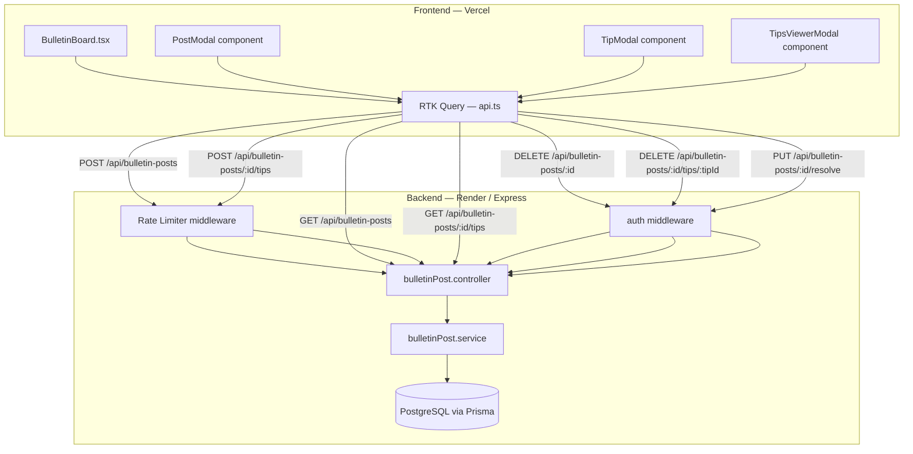

# Design Document: Bulletin Board

## Overview

The Bulletin Board feature extends the existing `/bulletin` page to support student-initiated "I lost this" posts alongside the current admin-logged lost items. Students post without logging in; community members submit anonymous tips; admins moderate via JWT-authenticated endpoints.

The key architectural shift from the current implementation is moving tip storage from `localStorage` to a server-side PostgreSQL database, and introducing a new `BulletinPost` entity that is distinct from the existing `LostItem` model.

Images are submitted as base64 data URIs in the JSON request body — consistent with how `ReportLostItem.tsx` already works (the server accepts up to 10 MB JSON bodies). The base64 string is stored directly in the `imageUrl` field of `BulletinPost`.

Rate limiting uses `express-rate-limit`, which must be added as a dependency (`npm install express-rate-limit`).

---

## Architecture



The frontend is a single-page React app. The bulletin board page fetches posts via RTK Query and renders them in a card grid. Modals are rendered as portal overlays. The backend follows the existing controller → service → Prisma pattern.

---

## Components and Interfaces

### Backend

**Module:** `server/src/app/modules/bulletinPost/`

- `bulletinPost.controller.ts` — Express request handlers
- `bulletinPost.service.ts` — Prisma queries
- `bulletinPost.validate.ts` — Zod schemas for request validation

**Routes added to `routes.ts`:**

```
POST   /api/bulletin-posts                        (public, rate-limited)
GET    /api/bulletin-posts                        (public)
POST   /api/bulletin-posts/:id/tips               (public, rate-limited)
GET    /api/bulletin-posts/:id/tips               (public)
DELETE /api/bulletin-posts/:id                    (admin auth required)
DELETE /api/bulletin-posts/:id/tips/:tipId        (admin auth required)
PUT    /api/bulletin-posts/:id/resolve            (admin auth required)
```

**Rate limiter middleware** (`server/src/app/midddlewares/bulletinRateLimit.ts`):
- `postCreationLimiter`: 5 requests / hour per IP
- `tipSubmissionLimiter`: 20 requests / hour per IP

### Frontend

**New RTK Query endpoints** (added to `api.ts`):

| Hook | Method | URL |
|---|---|---|
| `useGetBulletinPostsQuery` | GET | `/bulletin-posts` |
| `useCreateBulletinPostMutation` | POST | `/bulletin-posts` |
| `useGetBulletinTipsQuery` | GET | `/bulletin-posts/:id/tips` |
| `useCreateBulletinTipMutation` | POST | `/bulletin-posts/:id/tips` |
| `useDeleteBulletinPostMutation` | DELETE | `/bulletin-posts/:id` |
| `useDeleteBulletinTipMutation` | DELETE | `/bulletin-posts/:id/tips/:tipId` |
| `useResolveBulletinPostMutation` | PUT | `/bulletin-posts/:id/resolve` |

**New tag type** added to `baseApi.ts`: `"bulletinPosts"`

**Frontend components:**

- `BulletinBoard.tsx` — redesigned page; renders two sections: community posts grid + existing admin lost items grid
- `PostModal` (inline component) — multi-field form for creating a bulletin post; handles base64 image preview
- `TipModal` (inline component) — tip submission form; calls `useCreateBulletinTipMutation`
- `TipsViewerModal` (inline component) — fetches and displays tips via `useGetBulletinTipsQuery`; admin delete controls

---

## Data Models

### Prisma Schema Additions

```prisma
model BulletinPost {
  id           String        @id @default(uuid())
  itemName     String
  description  String
  location     String
  dateLost     DateTime
  imageUrl     String        @default("")
  reporterName String        @default("")
  contactHint  String        @default("")
  isResolved   Boolean       @default(false)
  isDeleted    Boolean       @default(false)
  deletedAt    DateTime?
  createdAt    DateTime      @default(now())
  updatedAt    DateTime      @updatedAt
  tips         BulletinTip[]

  @@map("bulletinPosts")
}

model BulletinTip {
  id             String       @id @default(uuid())
  bulletinPostId String
  bulletinPost   BulletinPost @relation(fields: [bulletinPostId], references: [id])
  location       String       @default("")
  details        String
  createdAt      DateTime     @default(now())

  @@map("bulletinTips")
}
```

**Design decisions:**
- No user/IP foreign key on `BulletinTip` — anonymity is enforced at the schema level.
- `imageUrl` stores a base64 data URI (consistent with existing `LostItem.img` pattern). The 10 MB JSON body limit already set in `app.ts` accommodates this.
- `isDeleted` on `BulletinPost` is a soft-delete flag; tips are hard-deleted (no moderation history needed for tips).
- `dateLost` is a `DateTime` field validated server-side to not be in the future.

### TypeScript Types (frontend)

```typescript
// frontend/src/types/types.ts additions
export interface BulletinPost {
  id: string;
  itemName: string;
  description: string;
  location: string;
  dateLost: string;
  imageUrl: string;
  reporterName: string;
  contactHint: string;
  isResolved: boolean;
  createdAt: string;
  _count?: { tips: number };
}

export interface BulletinTip {
  id: string;
  bulletinPostId: string;
  location: string;
  details: string;
  createdAt: string;
}
```

### API Request/Response Shapes

**POST /api/bulletin-posts**
```json
{
  "itemName": "Blue backpack",
  "description": "Left in Room 205 after class",
  "location": "Room 205",
  "dateLost": "2025-07-10T00:00:00.000Z",
  "imageUrl": "data:image/jpeg;base64,...",
  "reporterName": "Juan",
  "contactHint": "BSIT 2A"
}
```

**GET /api/bulletin-posts** (query params: `page`, `limit`, `searchTerm`)
```json
{
  "success": true,
  "meta": { "total": 42, "page": 1, "limit": 12, "totalPage": 4 },
  "data": [ /* BulletinPost[] with _count.tips */ ]
}
```

**POST /api/bulletin-posts/:id/tips**
```json
{ "location": "Library 2nd floor", "details": "Saw it near the charging station" }
```

---

## Correctness Properties

*A property is a characteristic or behavior that should hold true across all valid executions of a system — essentially, a formal statement about what the system should do. Properties serve as the bridge between human-readable specifications and machine-verifiable correctness guarantees.*

### Property 1: Post creation round-trip

*For any* valid bulletin post payload (non-empty item name, description ≥ 10 chars, location, past date), creating the post via `POST /bulletin-posts` and then fetching it via `GET /bulletin-posts` should return a record containing the same item name, description, location, and a non-null `id` and `createdAt`.

**Validates: Requirements 1.3, 1.8, 7.1, 7.3, 2.4**

---

### Property 2: Whitespace item name rejection

*For any* string composed entirely of whitespace characters (including the empty string), submitting it as `itemName` in a post creation request should be rejected with a 4xx error response and the post count should remain unchanged.

**Validates: Requirements 1.4**

---

### Property 3: Short description rejection

*For any* string of length 0–9 characters submitted as `description`, the post creation request should be rejected with a 4xx error response.

**Validates: Requirements 1.5**

---

### Property 4: Future date rejection

*For any* `dateLost` value that is strictly in the future (greater than the current server time), the post creation request should be rejected with a 4xx error response.

**Validates: Requirements 1.6**

---

### Property 5: Oversized image rejection

*For any* base64-encoded image whose decoded size exceeds 5 MB, the post creation request should be rejected with a 4xx error response indicating the size limit.

**Validates: Requirements 2.2**

---

### Property 6: Unsupported MIME type rejection

*For any* file whose MIME type is not `image/jpeg`, `image/png`, or `image/webp`, the post creation request should be rejected with a 4xx error response listing accepted formats.

**Validates: Requirements 2.3**

---

### Property 7: Card rendering completeness

*For any* bulletin post returned by the API, the rendered card component should contain the item name, a photo element (either the post image or a placeholder), the location, the date lost, the reporter name (when provided), and the tip count.

**Validates: Requirements 3.2, 3.3**

---

### Property 8: Pagination page size

*For any* `GET /bulletin-posts` request with a `limit` parameter, the number of posts in the response `data` array should be at most `limit`, and the response should include `meta.total`, `meta.page`, and `meta.totalPage`.

**Validates: Requirements 3.4, 7.6**

---

### Property 9: Resolved post shows badge and disables tip button

*For any* bulletin post where `isResolved = true`, the rendered card should display a "Resolved" badge and the "I Saw This" button should be disabled (or absent).

**Validates: Requirements 3.5, 4.7**

---

### Property 10: Search filtering correctness

*For any* non-empty search term, all posts returned by `GET /bulletin-posts?searchTerm=<term>` should contain the term (case-insensitive) in at least one of `itemName`, `description`, or `location`.

**Validates: Requirements 3.6**

---

### Property 11: Tip submission round-trip with count increment

*For any* existing bulletin post and any valid tip payload (details ≥ 10 chars), submitting the tip via `POST /bulletin-posts/:id/tips` should persist the tip, and a subsequent `GET /bulletin-posts/:id/tips` should include the submitted tip's details. The tip count on the post should increase by exactly 1.

**Validates: Requirements 4.2, 4.5, 7.7**

---

### Property 12: Short tip details rejection

*For any* string of length 0–9 characters submitted as `details` in a tip submission, the request should be rejected with a 4xx error response.

**Validates: Requirements 4.3**

---

### Property 13: Tips contain no PII fields

*For any* tip stored in the `BulletinTip` table, the record should not contain any user identifier, IP address, email, or other personally identifiable field beyond `location` and `details`.

**Validates: Requirements 4.6**

---

### Property 14: Tips display content

*For any* tip returned by `GET /bulletin-posts/:id/tips`, the rendered tip card should contain the `details` text, a relative time string, and the `location` value (when non-empty).

**Validates: Requirements 5.3**

---

### Property 15: Tips reverse-chronological order

*For any* list of tips returned by `GET /bulletin-posts/:id/tips`, the `createdAt` values should be in descending order (newest first).

**Validates: Requirements 5.4, 7.8**

---

### Property 16: Admin controls visibility

*For any* bulletin post card rendered in an admin session, a delete button should be visible. *For any* bulletin post card rendered in a non-admin (unauthenticated) session, no delete button should be visible. The same rule applies to tip cards in the tips viewer modal.

**Validates: Requirements 6.1, 6.3**

---

### Property 17: Post soft-delete removes from public list

*For any* bulletin post, after an admin issues `DELETE /bulletin-posts/:id`, a subsequent `GET /bulletin-posts` should not include that post in its results.

**Validates: Requirements 6.2**

---

### Property 18: Tip deletion decrements count

*For any* bulletin post with at least one tip, after an admin issues `DELETE /bulletin-posts/:id/tips/:tipId`, the tip should no longer appear in `GET /bulletin-posts/:id/tips` and the post's tip count should decrease by exactly 1.

**Validates: Requirements 6.4**

---

### Property 19: Moderation endpoints require authentication

*For any* moderation request (DELETE post, DELETE tip, PUT resolve) sent without a valid JWT `Authorization` header, the server should return HTTP 401.

**Validates: Requirements 6.6**

---

### Property 20: Post rate limit returns 429

*For any* IP address that has already made 5 `POST /bulletin-posts` requests within the current hour window, the next request should receive HTTP 429 with a descriptive error message in the response body.

**Validates: Requirements 8.1, 8.3**

---

### Property 21: Tip rate limit returns 429

*For any* IP address that has already made 20 `POST /bulletin-posts/:id/tips` requests within the current hour window, the next request should receive HTTP 429 with a descriptive error message in the response body.

**Validates: Requirements 8.2, 8.4**

---

## Error Handling

**Validation errors (400):** Zod schemas on the server validate all incoming request bodies. Invalid fields return `{ success: false, message: "<field> <reason>" }`. The frontend displays these messages inline in the form.

**Rate limit exceeded (429):** `express-rate-limit` returns `{ success: false, message: "Too many requests. Please try again later." }`. The frontend shows a toast notification.

**Not found (404):** Requests to non-existent post or tip IDs return `{ success: false, message: "Not found" }`.

**Unauthorized (401):** Moderation endpoints without a valid JWT return `{ success: false, message: "You are not authorized!" }` — reusing the existing `AppError` pattern.

**Image validation:** Performed client-side before submission (size > 5 MB, unsupported MIME type) to give immediate feedback. The server also validates the base64 prefix to guard against bypassed client checks.

**Network errors:** RTK Query's `isError` flag triggers a toast notification. The UI does not crash — empty states are shown instead.

---

## Testing Strategy

### Unit Tests

Focus on specific examples, edge cases, and integration points:

- Zod validation schemas: test boundary values (name = 1 char, name = 100 chars, name = 101 chars; description = 9 chars, 10 chars; future date, today's date)
- Service functions: mock Prisma client, verify correct `where` clauses for soft-delete filtering and search
- Rate limiter configuration: verify window and max values are set correctly
- Frontend form validation: test that submit is blocked when required fields are empty or invalid

### Property-Based Tests

Use **fast-check** (frontend, TypeScript) and **fast-check** or **jest-fast-check** (backend, TypeScript) for property tests. Each test runs a minimum of **100 iterations**.

Each property test is tagged with a comment in the format:
`// Feature: bulletin-board, Property <N>: <property_text>`

**Backend property tests** (`server/src/app/modules/bulletinPost/__tests__/bulletinPost.property.test.ts`):

| Property | Generator | Assertion |
|---|---|---|
| P1: Post creation round-trip | `fc.record({ itemName: fc.string({minLength:1,maxLength:100}), description: fc.string({minLength:10,maxLength:500}), location: fc.string({minLength:1}), dateLost: fc.date({max: new Date()}) })` | Created post id is non-null; GET returns matching record |
| P2: Whitespace item name rejection | `fc.stringOf(fc.constantFrom(' ','\t','\n'))` | Service throws / returns error |
| P3: Short description rejection | `fc.string({maxLength:9})` | Service throws / returns error |
| P4: Future date rejection | `fc.date({min: new Date(Date.now()+1)})` | Service throws / returns error |
| P8: Pagination page size | `fc.integer({min:1,max:50})` as limit | `data.length <= limit` and meta fields present |
| P10: Search filtering | `fc.string({minLength:1})` as searchTerm | All returned posts match term in at least one field |
| P11: Tip submission round-trip | `fc.string({minLength:10,maxLength:500})` as details | Tip appears in GET tips; count increments by 1 |
| P12: Short tip rejection | `fc.string({maxLength:9})` as details | Service throws / returns error |
| P15: Tips reverse-chronological | Multiple tips with varying createdAt | `tips[i].createdAt >= tips[i+1].createdAt` for all i |
| P17: Post soft-delete | Any valid post | After delete, GET /bulletin-posts excludes the post |
| P18: Tip deletion decrements count | Any post with ≥1 tip | After tip delete, count decreases by 1 |
| P20: Post rate limit | Simulate 6 requests from same IP | 6th returns 429 with message |
| P21: Tip rate limit | Simulate 21 requests from same IP | 21st returns 429 with message |

**Frontend property tests** (`frontend/src/pages/bulletin/__tests__/BulletinBoard.property.test.tsx`):

| Property | Generator | Assertion |
|---|---|---|
| P7: Card rendering completeness | `fc.record({ itemName, imageUrl, location, dateLost, reporterName, _count.tips })` | Rendered card contains all fields |
| P9: Resolved post badge | `fc.record({ ...post, isResolved: fc.constant(true) })` | Card contains "Resolved" badge; button is disabled |
| P14: Tips display content | `fc.record({ details: fc.string({minLength:10}), location: fc.option(fc.string()), createdAt: fc.date() })` | Rendered tip card contains details and relative time |
| P16: Admin controls visibility | `fc.boolean()` as isAdmin | Delete button present iff isAdmin=true |

**Unit test examples** (specific, non-property):

- `POST /bulletin-posts` with all valid fields → 201 with id
- `POST /bulletin-posts` with missing `itemName` → 400
- `DELETE /bulletin-posts/:id` without JWT → 401
- `GET /bulletin-posts` returns only non-deleted posts
- `GET /bulletin-posts/:id/tips` returns tips in descending createdAt order (concrete example with 3 tips)
- PostModal renders with "Post Lost Item" button visible to unauthenticated users
- TipsViewerModal shows empty-state message when tips array is empty (edge case: P13 zero-tips)
