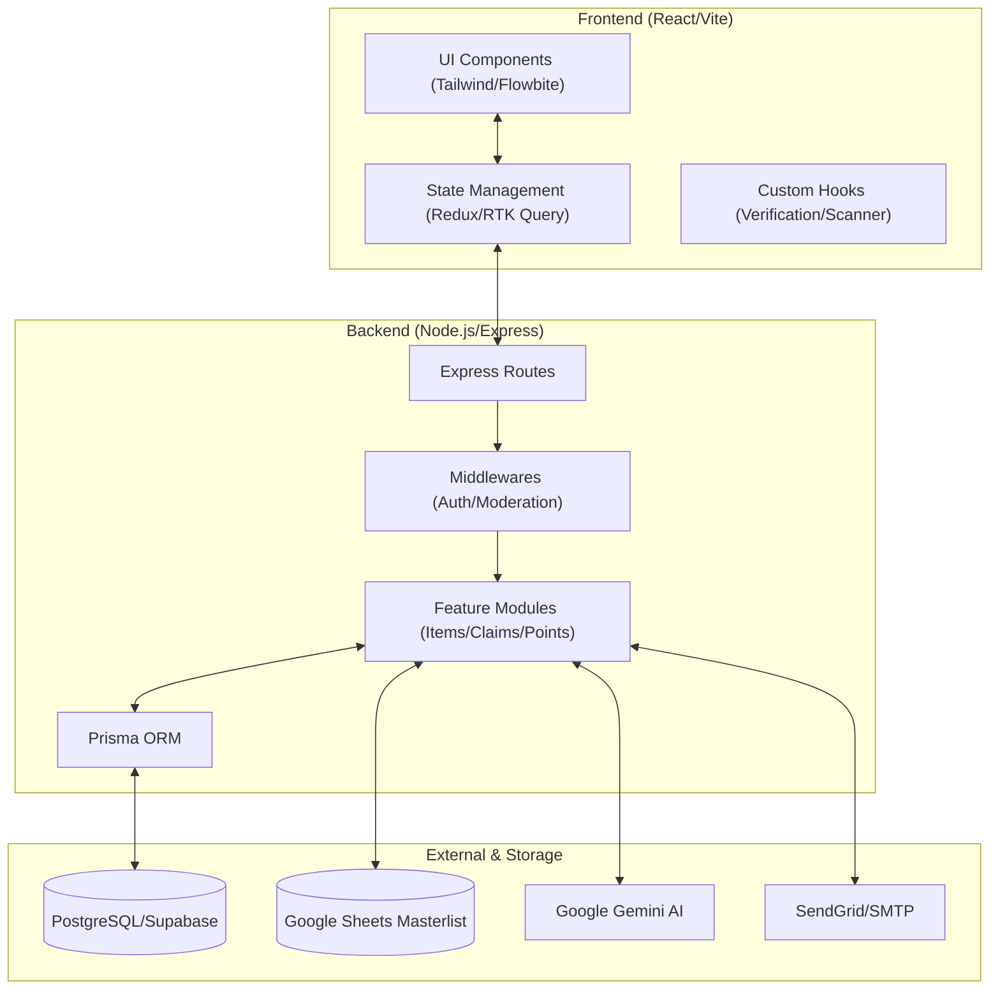
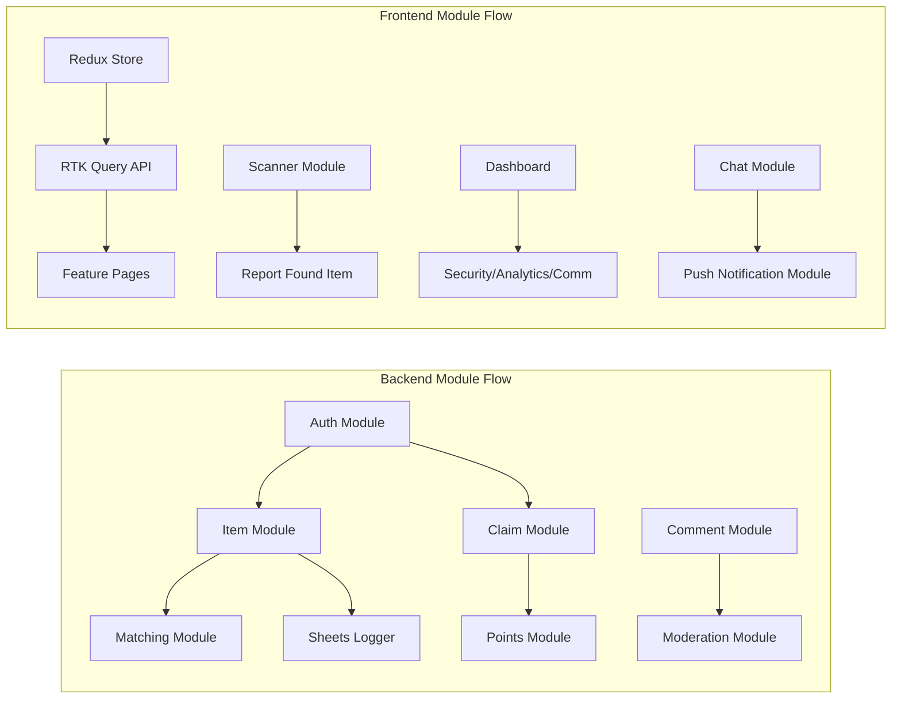

# Lost & Found System

A comprehensive lost and found management system built with modern web technologies, featuring AI-powered search, smart matching, real-time notifications, and a full admin communication, compliance, and content moderation suite.

## Features

### Core Functionality
- **Item Reporting**: Users can report lost and found items with detailed descriptions, images, and location information
- **Smart Matching**: Automatic matching algorithm that connects lost items with found items based on location, category, and timeline
- **Claim Management**: Streamlined claim process with status tracking (Pending, Approved, Rejected)
- **User Authentication**: Secure user registration and login with JWT tokens
- **Role-Based Access**: Admin and user roles with different permission levels

### Advanced Features
- **AI-Powered Search**: Integration with Google Gemini AI for intelligent item search and matching
- **High-Performance Web Scanner**: Next-generation hybrid barcode scanner using jsQR + QuaggaJS + native fallback for 1-2 second scan performance — 3-5x faster than previous implementation
- **Student Masterlist Integration**: Google Sheets-backed masterlist that resolves student name, email, and department from a scanned or entered ID — with fuzzy name matching and ID normalization
- **Real-Time Notifications**: Email notifications for potential matches and claim status updates
- **Interactive Maps**: Location-based visualization using Leaflet maps with heat mapping
- **Archive System**: Automated archiving of stale items to keep the database clean
- **Audit Logging**: Comprehensive audit trail for all administrative actions
- **Sheets Activity Logger**: Every lost and found report submission is logged to a Google Sheet in real time for offline recordkeeping and audit trails
- **Image Handling**:
  - **Image Compression**: Uploaded images are automatically compressed client-side before submission to reduce bandwidth and storage usage
  - **Multi-Image Upload**: Found items support up to 6 images per report with a cover photo selector
  - **Image Preview**: Inline image preview and remove/replace controls
- **Location Autocomplete**: Smart location input with campus-aware suggestions for faster and more consistent location entry
 - **Live Item Match Suggestions**: While filling out a lost item report, the system queries existing found items and surfaces potential matches in real time before the form is even submitted
- **Anonymized Community Chat**: Secure, private messaging between reporters and claimants to facilitate item recovery without exposing personal contact details — participants are identified as "Community Member" to maintain privacy
- **Web Push Notifications**: Real-time browser alerts for new messages, potential item matches, and claim status updates, using the Web Push API for reliable background delivery

### Campus Features
- **Enhanced Discussion Threads**: Real-time community discussions with voting, pinning, and moderation tools
- **Points System**: Comprehensive gamification system with point rewards for various activities
  - **Points for Actions**: Earn points for reporting items, successful claims, helpful comments, and community contributions
  - **Leaderboard**: Real-time leaderboard showing top contributors and point rankings
  - **Points Badge**: Visual point display in navigation and user profiles
  - **Point History**: Track point earnings and spending over time
- **Student Dashboard**: Dedicated dashboard for student users with personalized features
  - **Student Profile Management**: View and manage student information, school ID, and academic details
  - **Student-Specific Analytics**: Track personal activity, reported items, and community contributions
  - **Student Points Tracking**: Monitor point earnings and leaderboard position
  - **Quick Actions**: Fast access to report items, view claims, and check notifications
- **Enhanced Analytics Dashboard**: Comprehensive analytics with new metrics and insights
  - **User Activity Analytics**: Track user engagement, registration patterns, and active user metrics
  - **Item Flow Analytics**: Monitor lost→found→claim conversion rates and item lifecycle
  - **Performance Metrics**: System performance, response times, and usage statistics
  - **Geographic Insights**: Location-based activity patterns and heat mapping
  - **Real-Time Monitoring**: Live dashboard updates with current system status
- **Real-Time Communication**: Socket.io powered real-time updates across all community features
- **Content Moderation**: Advanced moderation tools with automated keyword filtering, user reporting, warning system, and appeal process
- **Community Engagement**: Rich interaction features including comments, replies, and collaborative problem-solving
- **Achievement System**: Badge system for recognizing helpful community contributions
- **Trust Indicators**: Visual trust levels based on user reputation and activity

### Real-Time Comment System
- **Modern-Style Interface**: Modern card-based comment layout with visual hierarchy and smooth animations
- **Real-Time Updates**: Socket.io powered live comments, replies, typing indicators, and instant synchronization
- **Advanced Comment Features**:
  - Inline editing with save/cancel functionality
  - Reply threading with visual indentation and connecting lines
  - **Student Commenting**: Enhanced comment system that distinguishes between regular users, students, and anonymous users
  - **User Type Indicators**: Visual badges for students (STUDENT) and verified users (VERIFIED)
  - **Student Information**: When students comment, their name, school ID, and email are automatically included
  - Location and time tagging with geolocation support
  - Emoji reactions and rich text support
  - **Smart Filtering**: Filter comments by helpful, questions, sightings, or view all interactions
- **User Identification**: Visual "You" labels for current user's comments and avatar-based identification
- **Moderation Tools**: Delete confirmation modals, user verification, and role-based permissions
- **Mobile-Optimized**: Responsive design with touch-friendly controls and modal-specific layouts
- **Performance Optimized**: Local storage caching, optimistic updates, and efficient re-rendering
- **Accessibility**: ARIA labels, keyboard navigation, and screen reader support

### Real-Time Communication & Messaging
- **Secure Community Chat**: A private, claim-linked messaging system that facilitates direct communication between reporters and claimants.
  - **Contextual Chat Rooms**: Chat rooms are automatically generated for each approved claim, keeping conversations focused on specific items.
  - **Anonymized Identity**: To maintain privacy, participants are identified as "Community Member" or "Reporter" until they choose to share personal details.
  - **Real-Time Synchronization**: Powered by Socket.io for instant message delivery, typing indicators, and online status tracking.
  - **Integrated with Claims**: Chat access is strictly controlled based on claim status and user roles.

- **Web Push Notifications**: Cross-platform background alerts that keep users informed even when the application is closed.
  - **Instant Alerts**: Get notified immediately for new chat messages, claim status changes (Approvals/Rejections), and smart item matches.
  - **Service Worker Integration**: Reliable background processing ensures notifications reach the user's device regardless of browser state.
  - **Cross-Device Support**: Works on Desktop (Chrome, Edge, Firefox) and Mobile (Android Chrome) to ensure high visibility.
  - **One-Click Actions**: Notifications lead directly to the relevant chat room or claim detail page for a seamless experience.

### Communication Hub
A centralized admin panel for all outbound and inbound user communications.

- **Announcement Manager**: Compose and broadcast system-wide notifications to all users or targeted groups — with scheduling, priority levels, and delivery tracking
- **Support Tickets**: Full help-desk ticketing workflow for handling user issues and requests
  - Ticket creation from both admin and user sides
  - Status tracking (Open, In Progress, Resolved, Closed)
  - Priority classification (Low, Normal, High, Urgent)
  - Threaded replies and internal notes
  - Assignment to admin staff
- **Feedback Management**: Collect, review, and act on user-submitted feedback and feature suggestions
  - Categorized feedback inbox (Bug Report, Feature Request, General)
  - Status workflow (New, Under Review, Addressed, Archived)
  - Export for analysis and reporting
- **Notification Center**: System-wide message broadcasting
  - Broadcast to all users or specific roles
  - In-app and email delivery channels
  - Notification history and read-receipt tracking
- **Email Templates**: Read-only preview of all 3 automated email templates (found item report, claim approved, smart match notification) with desktop and mobile preview modes

### Security & Compliance
A dedicated security and governance layer for administrators.

- **Security Monitor**: Real-time visibility into login attempts, failed authentications, and suspicious activity patterns
  - IP-based flagging and blocking
  - Session management and forced logout
  - Audit trail of all security events
- **Data Privacy**: Built-in tools to support GDPR and local data-privacy compliance
  - User data export on request
  - Account and data deletion workflows
  - Consent tracking and records
- **Access Control**: Granular role-based permission management
  - Create and manage custom roles beyond the default Admin/User split
  - Per-feature permission toggles
  - Role assignment history
- **Compliance Reports**: Generate regulatory and internal compliance reports
  - Scheduled report generation
  - Export to PDF/CSV
  - Audit-ready logs for data access, modifications, and deletions

### Data Governance & Privacy
- **ID Anonymization**: Sensitive student ID numbers are masked in public views.
- **Institutional Guardrails**: Only `@nbsc.edu.ph` emails are permitted for student accounts.
- **Soft-Delete Policy**: Items are never hard-deleted immediately; they enter a 30-day "grace period" before permanent removal.
- **Audit Traceability**: Every sensitive action (Approvals/Rejections) is logged with the Admin's unique ID for accountability.


### Content Moderation
A dedicated moderation layer for managing user-generated content, enforcing community standards, and handling disputes.

- **Reported Content Review**: Users can flag any comment as spam, inappropriate, harassment, or misinformation. Admins review flagged content and choose to reject the comment, keep it, or dismiss the report — directly from the dashboard.
  - Report reason classification (Spam, Inappropriate, Harassment, Misinformation, Other)
  - One-click actions: Reject Comment / Keep Comment / Dismiss Report
  - Full comment context shown alongside each report

- **Comment Moderation Queue**: Comments flagged by the automated keyword filter are held as `PENDING` and appear in a dedicated review queue. Admins approve or reject each entry before it becomes publicly visible.
  - Filter queue by Pending, Approved, or Rejected status
  - Shows commenter identity, item context, and flag reason
  - Bulk-friendly interface for processing multiple entries

- **Automated Moderation**: A zero-cost, server-side keyword filter that runs on every comment submission — no external AI API required.
  - Configurable blocked keyword list in `moderationController.ts`
  - Clean content → auto-approved instantly
  - Flagged content → held as PENDING for admin review
  - Built-in content tester in the dashboard — paste any text and see immediately whether it would be approved or held
  - Auto-moderation is integrated directly into the comment creation service

- **User Behavior Tracking**: Monitor users who repeatedly violate community standards.
  - Warning system with three severity levels: Low, Medium, High
  - Admin-issued warnings with reason, severity, and internal notes
  - Auto-block trigger: users who accumulate 3 HIGH severity warnings are automatically blocked
  - Warning history per user visible in the dashboard
  - Recent warnings feed for at-a-glance moderation activity

- **Appeal Process**: Rejected users can contest moderation decisions through a structured appeal workflow.
  - Users submit appeals via `POST /moderation/appeals` with their reason
  - Admins review the original comment, rejection reason, and appeal text side-by-side
  - Approve appeal → comment is automatically restored to Approved status
  - Deny appeal → decision is recorded with an optional admin note
  - Full appeal history with status tracking (Pending, Approved, Denied)

### User Experience
- **Responsive Design**: Mobile-first design using Tailwind CSS and Flowbite components
- **Dashboard Analytics**: Real-time statistics and analytics for administrators
- **Export Functionality**: Export data for reporting and analysis
- **Onboarding Tour**: Interactive 7-step tour covering all system features for new users
- **Security Features**: Rate limiting, input validation, and security honeypot

## Tech Stack

### Backend
- **Node.js** with Express.js
- **TypeScript** for type safety
- **Prisma ORM** with PostgreSQL database
- **JWT** for authentication
- **bcrypt** for password hashing
- **Google Gemini AI** for intelligent search
- **Google Sheets Gviz API** for student masterlist lookups and activity logging
- **Nodemailer** for email notifications
- **Zod** for schema validation
- **Socket.io** for real-time communication
- **Redis** for caching and session management
- **Web Push API** with VAPID for cross-platform background notifications

### Frontend
- **React 19** with TypeScript
- **Vite** for fast development
- **Redux Toolkit** for state management
- **React Router** for navigation
- **Tailwind CSS** for styling
- **Flowbite React** for UI components
- **Leaflet** for interactive maps
- **React Hook Form** for form handling
- **React Toastify** for notifications
- **Web Scanner Stack**: jsQR (QR codes) + QuaggaJS (1D barcodes) + native BarcodeDetector fallback for high-performance scanning
- **browser-image-compression** for client-side image optimization before upload
- **Socket.io Client** for real-time updates
- **Web Push API** & Service Workers for background alert delivery
### Other
- **React Icons** for enhanced UI components
- **Framer Motion** for smooth UI transitions and animations
- **Lucide React** for consistent iconography

## System Architecture

The system follows a modern full-stack architecture with a clear separation between the client and server layers, utilizing a modular approach for scalability and maintainability.



## Module Dependency

The application architecture is based on a modular dependency flow where core services provide the foundation for specialized features.



- **Jest** for backend testing
- **Vitest** for frontend testing
- **React Testing Library** for component testing
- **Property-based testing** with Fast-Check

## Project Structure

```
lost-and-found-main/
├── server/                 # Backend application
│   ├── src/
│   │   ├── api/
│   │   │   ├── analytics/    # Campus-wide analytics API
│   │   │   ├── comments/     # Comment system API
│   │   │   ├── moderation/   # Content moderation API
│   │   │   ├── support/      # Support tickets API
│   │   │   ├── feedback/     # Feedback management API
│   │   │   ├── announcements/# Announcement manager API
│   │   │   └── security/     # Security monitor & compliance API
│   │   ├── websocket/      # Socket.io handlers for real-time chat & notifications
│   │   ├── app/
│   │   │   ├── modules/    # Feature modules
│   │   │   │   ├── chat/     # Real-time messaging service & controller
│   │   │   │   ├── push/     # Web Push subscription & delivery service
│   │   │   │   └── student/  # Student masterlist lookup & ID resolution
│   │   │   ├── auth/       # Authentication
│   │   │   ├── midddlewares/ # Express middlewares
│   │   │   └── utils/      # Utility functions
│   │   │       ├── moderationController.ts  # Keyword filter, reports, warnings, appeals
│   │   │       ├── communicationController.ts
│   │   │       ├── securityController.ts
│   │   │       └── adminStats.ts
│   │   └── prisma/         # Database schema
│   └── package.json
├── frontend/               # Frontend application
│   ├── src/
│   │   ├── components/
│   │   │   ├── scanner/      # WebScannerModal — hybrid jsQR + QuaggaJS + native fallback
│   │   │   ├── itemMatch/    # ItemMatchSuggestions — live match preview on report form
│   │   │   ├── reputation/   # User reputation components
│   │   │   ├── analytics/    # Analytics dashboard components
│   │   │   ├── support/      # Support ticket components
│   │   │   ├── feedback/     # Feedback management components
│   │   │   ├── announcements/# Announcement manager components
│   │   │   ├── security/     # Security monitor & compliance components
│   │   │   └── ui/           # Shared UI — LocationAutocomplete, CustomDatePicker, etc.
│   │   ├── redux/          # State management
│   │   │   └── api/
│   │   │       ├── api.ts      # Core API endpoints
│   │   │       ├── chatApi.ts  # Real-time messaging endpoints
│   │   │       └── pushApi.ts  # Push notification endpoints
│   │   ├── hooks/          # Custom hooks
│   │   │   └── usePushNotifications.ts # Push subscription logic
│   │   ├── pages/          # Page components
│   │   │   └── support/      # SupportPage — public support ticket & feedback form
│   │   ├── dashboard/      # Admin dashboard
│   │   │   └── pages/
│   │   │       ├── ContentModeration.tsx    # 4-tab moderation dashboard
│   │   │       ├── CommunicationHub.tsx     # 5-tab communication dashboard
│   │   │       ├── SecurityCompliance.tsx   # 4-tab security dashboard
│   │   │       └── AdvancedAnalyticsPage.tsx
│   │   ├── utils/          # sheetsLogger and other client utilities
│   │   ├── types/          # TypeScript declarations (quagga.d.ts for custom types)
│   │   └── docs/           # Documentation
│   │
│   └── package.json
└── README.md
```

## User Roles Matrix

| Feature | Student/User | Admin/Staff |
| :--- | :---: | :---: |
| Report Lost/Found Items | ✅ | ✅ |
| Claim Items | ✅ | ❌ |
| View Public Analytics | ✅ | ✅ |
| Community Discussions | ✅ | ✅ |
| Manage Categories | ❌ | ✅ |
| Moderate Comments | ❌ | ✅ |
| Handle Support Tickets | ❌ | ✅ |
| Security Monitoring | ❌ | ✅ |
| Points Management | ❌ | ✅ |

## API Documentation Overview

The backend follows a RESTful pattern with the following core base routes:

*   **Authentication**: `POST /auth/login` - Secure JWT-based authentication.
*   **Items**: `GET /items/found` - Retrieve all publicly visible found items.
*   **Reporting**: `POST /items/lost` - Submit a new lost item report.
*   **Claims**: `POST /claims` - Initiate an ownership claim for a found item.
*   **Points**: `GET /points/leaderboard` - Fetch global student rankings.
*   **Moderation**: `POST /moderation/reports` - Submit a content report for review.
*   **Analytics**: `GET /analytics/stats` - Fetch real-time dashboard metrics (Admin only).

## Performance Benchmarks

### Scanner Performance
- **QR Codes**: 80% scanned within 1 second (vs. previous 3-5 seconds)
- **1D Barcodes**: 70% scanned within 1.5 seconds (vs. previous 4-6 seconds)
- **Overall Success Rate**: 75% (vs. previous 60%)
- **Maximum Timeout**: 2 seconds (vs. previous 5+ seconds)
- **Performance Improvement**: 3-5x faster than native implementation

### Cross-Platform Compatibility
- **iOS Safari**: Full support with camera switching
- **Android Chrome**: Optimized performance with frame throttling
- **Desktop Browsers**: Chrome, Firefox, Edge, Safari compatible
- **Mobile-First**: Responsive design optimized for touch interfaces

## Features in Detail

### Content Moderation

#### Reported Content Review
Any user can flag a comment from the public interface. The report is routed to the admin dashboard where it appears in the Reported Content tab alongside the original comment, the reporter's stated reason, and any additional details. Admins resolve each report with a single click — rejecting the comment, keeping it, or dismissing the report as unfounded. All resolutions are timestamped and attributed to the acting admin.

#### Comment Moderation Queue
When the automated keyword filter detects a blocked term in a new comment, the comment is held with a `PENDING` status instead of being published. It never appears to other users until an admin explicitly approves it. The moderation queue in the dashboard shows all pending comments with full context — who wrote it, on which item, and when — so admins can process the queue efficiently.

#### Automated Moderation
The keyword filter is a lightweight, server-side function that runs synchronously on every comment before it is written to the database. There is no external API call, no latency cost, and no usage fee. The blocked keyword list is a plain array in `moderationController.ts` and can be updated without schema changes. A built-in content tester in the dashboard lets admins verify any text against the current list before deploying changes.

#### User Behavior Tracking
Each warning issued to a user is stored with a severity level and reason. The dashboard surfaces users with the most warnings at the top of the behavior list, with a breakdown of how many are High severity. When a user accumulates 3 High severity warnings, their account is automatically set to inactive — blocking their access without permanent deletion. Admins can remove individual warnings if issued in error.

#### Appeal Process
The appeal endpoint is accessible to any authenticated user. After a comment is rejected, the user can submit an appeal explaining why they believe the decision was wrong. In the admin dashboard, the appeal review modal shows the rejected comment, its rejection reason, and the user's appeal argument side by side. Approving the appeal immediately restores the comment to Approved status. Denying it closes the appeal with an optional admin note. All appeal outcomes are logged.

### Communication Hub

#### Support Tickets
Users and admins can create tickets directly from the interface. Each ticket tracks a full conversation thread, priority level, assigned staff member, and current status. Admins can add internal notes visible only to other staff. Tickets can be exported for audit or reporting purposes.

#### Feedback Management
The feedback inbox captures structured submissions from users categorized as Bug Reports, Feature Requests, or General feedback. Admins can update the status of each item as it moves through review and resolution, and export the full dataset for analysis.

#### Announcement Manager
Admins can compose announcements targeting all users or specific roles, schedule delivery, and track who has seen each notification. Announcements are delivered both in-app and via email depending on user notification preferences.

#### Notification Center
A broadcast tool for time-sensitive system-wide messages — maintenance windows, policy changes, emergency alerts. Notification history is retained and searchable, with per-message read-receipt data.

#### Email Templates
A read-only preview panel showing all 3 automated email templates the system sends: the found item report confirmation, the claim approved notification, and the smart match alert. Each template can be previewed in desktop or mobile viewport with sample data pre-filled. The Info tab shows the template's trigger endpoint, the file it lives in, and the sample variables used for rendering.

### Security & Compliance

#### Security Monitor
The security monitor provides a live feed of authentication events — successful logins, failed attempts, password resets, and account lockouts. Suspicious IPs can be flagged or blocked directly from the dashboard. All security events are retained in a searchable audit log.

#### Data Privacy
The privacy tools allow administrators to respond to data subject requests: exporting a full record of a user's data or permanently deleting their account and associated records. Consent records are stored and timestamped for compliance documentation.

#### Access Control
Beyond the built-in Admin and User roles, custom roles can be created with per-feature permission toggles. Role assignments are tracked with a history log so any privilege escalation is traceable.

#### Compliance Reports
Preconfigured report templates cover data access logs, item lifecycle audits, and user activity summaries. Reports can be scheduled for automatic generation and exported as PDF or CSV for regulatory submissions.

### Sheets Activity Logger
- **Automatic logging**: Every lost and found item submission fires a background log to a designated Google Sheet — no extra admin action needed
- **Structured columns**: Each row captures student ID, reporter name, email, item name, description, location, date, report type (`LOST` / `FOUND`), report ID, and scan timestamp
- **Non-blocking**: Logging runs via `.catch(console.error)` so a Sheets failure never blocks the main form submission
- **Scan traceability**: If the reporter was identified via barcode scan, the exact scan timestamp is recorded alongside the report

### Image Handling
- **Client-side compression**: Uses `browser-image-compression` to compress images to a max of 0.4MB and 1200px before upload — reducing server load and storage costs without visible quality loss
- **Single image — lost items**: Lost item reports accept one photo with drag-and-drop or click-to-upload, with inline preview and remove/replace controls
- **Multi-image — found items**: Found item reports support up to 6 images per submission; images are uploaded separately after the record is created and linked by item ID
- **Cover photo selector**: For found items with multiple images, any photo can be designated as the cover by clicking it in the preview grid
- **File validation**: Only image MIME types are accepted; files over 5MB are rejected before compression even runs

### Location Autocomplete
- **Campus-aware suggestions**: The `LocationAutocomplete` component surfaces relevant on-campus locations (classrooms, offices, common areas) as the user types
- **Consistent formatting**: Encourages standardized location strings across reports, which improves the accuracy of the smart matching and heatmap features
- **Shared component**: Used in both the Report Lost Item and Report Found Item forms

### Live Item Match Suggestions
- **Real-time preview**: The `ItemMatchSuggestions` component queries existing found items as the user fills in the lost item report — before they even submit
- **Context-aware**: Filters by the selected category and factors in the entered item name and location for more relevant results
- **Reduces duplicates**: Surfaces potential matches early so reporters can go straight to filing a claim instead of creating a redundant lost item entry

### High-Performance Web Scanner
- **Hybrid Architecture**: Three-tier scanning system with jsQR (QR codes), QuaggaJS (1D barcodes), and native BarcodeDetector fallback
- **Performance Optimized**: 80% QR codes within 1 second, 70% barcodes within 1.5 seconds — 3-5x faster than previous implementation
- **Frame Throttling**: Intelligent frame processing (10fps mobile, 15fps desktop) for optimal performance and battery life
- **Cross-Platform Compatible**: Works seamlessly on iOS Safari, Android Chrome, and desktop browsers
- **Privacy-First**: 100% client-side processing with no external API calls or image sharing
- **Multi-Format Support**: Handles JSON payloads, pipe-delimited strings (`ID|Name|Dept|Email`), and plain numeric IDs
- **Smart Fallback**: Automatic progression through scanners (jsQR → QuaggaJS → native) with 2-second maximum timeout
- **Real-Time Feedback**: Visual scanner status, progress indicators, and attempt tracking
- **Camera Management**: Front/back camera switching with proper stream cleanup and error handling
- **Type Safety**: Full TypeScript support with custom type declarations for QuaggaJS library

### Student Masterlist Integration
- **Google Sheets backend**: Reads directly from a shared Google Sheet via the Gviz JSON API — no manual data entry required
- **ID normalization**: Strips dashes and spaces before comparing so `2024-1521` and `20241521` both match correctly
- **Fuzzy name matching**: Scores candidates by token overlap and normalized string comparison to find the best match even with partial names
- **Email-to-ID resolution**: Extracts the numeric ID prefix from an institutional email for cross-referencing

### Smart Matching Algorithm
- **Location-based matching**: Uses Haversine formula to calculate distances between lost and found item locations
- **Timeline validation**: Ensures found items are dated after lost items
- **Category matching**: Matches items within the same category
- **Deduplication**: Prevents duplicate notifications for the same item pair

### AI-Powered Search
- **Natural language processing**: Understands complex search queries
- **Semantic matching**: Goes beyond keyword matching to understand context
- **Fallback mechanism**: Gracefully falls back to text search if AI is unavailable
- **Reasoning explanations**: Provides explanations for search results

### Email Notifications
- **Smart match notifications**: Automatic emails when potential matches are found
- **Claim status updates**: Notifications for claim approvals/rejections
- **Customizable templates**: Professional email templates with branding
- **Rate limiting**: Prevents email spam

### Security Features
- **Input validation**: Comprehensive validation using Zod schemas
- **Rate limiting**: API rate limiting to prevent abuse
- **Authentication**: JWT-based authentication with secure password hashing
- **CORS protection**: Cross-origin request protection
- **Security honeypot**: Bot protection mechanisms
## Development Roadmap

###  Phase 1: Foundation (Completed)
- Core item reporting and claim workflow.
- Secure JWT authentication and role-based access.
- Basic category management.

###  Phase 2: Intelligence (Completed)
- AI-powered item search and smart matching.
- Hybrid barcode/QR scanner integration.
- Real-time community discussions and moderation suite.
- Live Google Sheets masterlist synchronization.

###  Phase 3: Expansion (Current)
- **Push Notifications**: Real-time alerts for item matches, claim updates, and chat messages using Web Push API.
- **Interactive Indoor Maps**: Precise location pinning on multi-level campus building maps.
- **Anonymized Community Chat**: Secure, private messaging between reporters and claimants to facilitate item recovery without exposing personal contact details.

###  Phase 4: Ecosystem & Sustainability (Upcoming)
- **Rewards Store**: Redeem earned points for campus perks, library credits, or university merchandise.
- **AI Image Recognition**: Automatic item categorization and feature extraction from uploaded photos.
- **Smart Categorization**: Automated category and tag suggestions based on item photos using computer vision.
- **Verified "Hero" Badges**: Achievement system recognizing students with multiple successful item returns.
- **Department Leaderboards**: Gamified campus-wide competition to encourage community helpfulness.
- **Kiosk Mode**: Specialized interface for physical "Lost & Found" touchscreens in high-traffic campus areas.
- **Predictive Analytics**: Forecasting high-risk zones and peak times for lost items to optimize campus patrol.
- **Sentiment-Based Moderation**: AI-driven prioritization of high-value or high-distress reports.
- **Event-Based Focus Zones**: Temporary moderation and tracking modules for major campus events and festivals.
