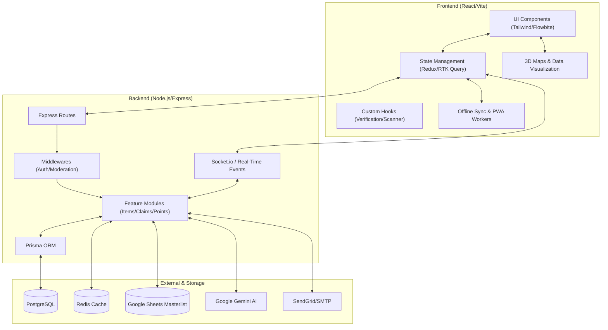
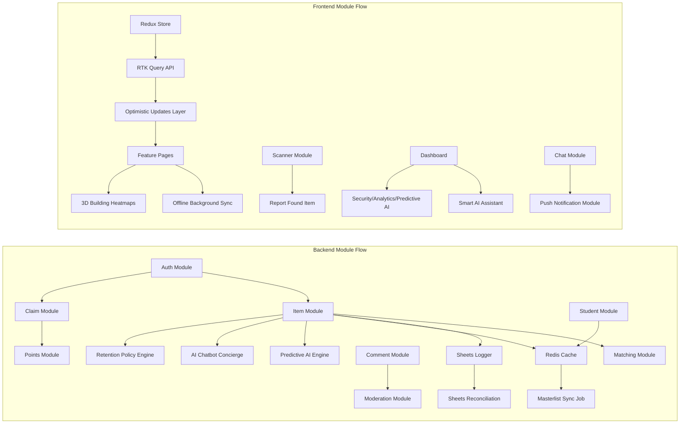

# Lost & Found System

A comprehensive lost and found management system built with modern web technologies, featuring AI-powered search, smart matching, real-time notifications, high-performance Redis caching, optimistic UI updates, automated data governance, and a full admin communication, compliance, and content moderation suite.

## Features

### Core Functionality
- **Item Reporting**: Users can report lost and found items with detailed descriptions, images, and location information
- **Smart Matching**: Automatic matching algorithm that connects lost items with found items based on location, category, and timeline
- **Claim Management**: Advanced claim review system with bulk approve/reject, AI-powered claimant identity verification scoring, and a dual-view (Table + Timeline) interface for managing the full lifecycle of every claim
- **Interactive Journey Tracking**: Visual, data-driven timeline tracing the complete lifecycle of a claim or lost report, dynamically aggregating sightings and verification milestones
- **User Authentication**: Secure user registration and login with JWT tokens
- **Role-Based Access**: Admin and user roles with different permission levels

### Advanced Features
- **Magic AI Scan**: Instantly identify items from a single photo — automatically populates item name, detailed description, color, and condition using computer vision
- **AI-Powered Search**: Integration with Google Gemini AI for intelligent item search and matching
- **AI-Powered Story Writer**: Integrated spotlight drafting utility inside the Recognition Feed dashboard. Staff enter brief bullet points, and Google Gemini instantly generates heartwarming, inspiring, and professional student recognition titles and complete narrative stories.
- **High-Performance Web Scanner**: Next-generation hybrid barcode scanner using jsQR + QuaggaJS + native fallback for 1-2 second scan performance — 3-5x faster than previous implementation
- **Continuous Bulk Scanner**: Seamlessly scan multiple IDs or items in rapid succession without closing the scanner interface. Maintains persistent state and automatically fills location data, supercharging mass-processing workflows for security and admin staff.
- **Student Masterlist Integration**: Google Sheets-backed masterlist that resolves student name, email, and department from a scanned or entered ID — with fuzzy name matching and ID normalization
- **Real-Time Notifications**: Email notifications for potential matches and claim status updates
- **Interactive Maps**: Location-based visualization using Leaflet maps with heat mapping
- **Indoor 3D Map**: Interactive, multi-level 3D campus building maps for precise room-level item localization with integrated heat mapping to visualize item-density patterns across floors (Desktop use only)
- **Archive System**: Automated archiving of stale items to keep the database clean
- **Audit Logging**: Comprehensive audit trail for all administrative actions
- **Sheets Activity Logger**: Every lost and found report submission is logged to a Google Sheet in real time for offline recordkeeping and audit trails
- **Google Sheets Reconciliation**: Automated weekly integrity checker that compares database records with Google Sheets logs to detect silent logging failures caused by network errors or offline submissions. Runs every Sunday at 11:00 PM, sends email alerts to administrators when discrepancies are found, and provides one-click re-sync functionality to automatically fix missing entries. Ensures complete audit trail for compliance.
- **Redis Masterlist Cache**: High-performance local caching layer for student ID resolution that eliminates Google Sheets Gviz API as a single point of failure. Student ID lookups hit Redis first (< 5ms response) with automatic fallback to Google Sheets on cache miss. Background sync job refreshes cache every 6 hours. Scanner remains operational during Google Sheets outages, rate-limiting events, or network failures. Provides 40-100x faster lookups compared to direct Gviz API calls.
- **Optimistic UI Updates**: Instant feedback system for all major admin dashboard actions that updates the UI immediately before server confirmation, making the interface feel 2-3x faster. Implements 12 optimistic mutations including archive/restore items, update claim status, delete operations, user management, bulletin actions, comments, and spotlights. Features automatic rollback on server errors, with admin actions responding in <16ms instead of 200-500ms (15-30x faster perceived performance). Creates native-app-like responsiveness with zero breaking changes.
- **Image Handling**:
  - **Image Compression**: Uploaded images are automatically compressed client-side before submission to reduce bandwidth and storage usage
  - **Multi-Image Upload**: Found items support up to 6 images per report with a cover photo selector
  - **Image Preview**: Inline image preview and remove/replace controls
- **Location Autocomplete**: Smart location input with campus-aware suggestions for faster and more consistent location entry
 - **Live Item Match Suggestions**: While filling out a lost item report, the system queries existing found items and surfaces potential matches in real time before the form is even submitted
- **Anonymized Community Chat**: Secure, private messaging between reporters and claimants to facilitate item recovery without exposing personal contact details — participants are identified as "Community Member" to maintain privacy
- **Web Push Notifications**: Real-time browser alerts for new messages, potential item matches, and claim status updates, using the Web Push API for reliable background delivery
- **Predictive Analytics**: AI-driven forecasting engine that identifies high-risk campus zones and peak loss times using historical data patterns to optimize security patrols
- **Proximity Hotspot Alerts**: Mobile-specific geofencing warning widget integrated within the Student Dashboard. Using live coordinates and database item reports, the system computes real-time proximity (Haversine formula) to high-risk zones. It triggers haptic micro-vibrations (`navigator.vibrate`) and slides down custom glassmorphic warning banners accented with gradients matching the specific risk rating (Critical, High, Medium, Low), displaying live statistics and safety pro-tips. Includes an interactive GPS telemetry simulator panel for easy developer testing.
- **AI-Powered "Match-Score" Recommender**: Computes multi-faceted proximity and textual similarity percentage scores (synthesizing locations, timeline, categories, and keyword overlaps) to pair lost and found reports. Features a stunning side-by-side interactive card comparison, custom match threshold control sliders, mobile-optimized responsive buttons, and 1-click SMTP-supported email notifications to instantly connect finder and owner.
- **Dynamic Interactive Hero Carousel**: A multi-slide auto-playing hero banner highlighting major entry points (Lost reporting, Found logs, Recovery tracing) featuring responsive buttons and smooth slider telemetry.
- **Live Telemetry & Activity Stats Board**: Live campus lost-and-found status counter displaying real-time aggregates of total reported lost, recovered found, and successfully claimed items synced directly with server database mutations.
- **Double Live Feed Recent Panels**: Real-time recent Lost and Found item displays containing active status badge trackers (`✓ Found`, `Claimed`, `Available`, `Pending`), scrollable custom layouts, and fast direct routing.
- **Offline Sync**: Staff members can scan barcodes or submit "Found Items" while offline. The app saves the data securely in the browser and automatically uploads it in the background as soon as they walk back into a WiFi zone.
- **Strict Audit Trail**: A dedicated, un-deletable "Audit Log" page for Administrators that shows exactly who performed which action and when. This ensures complete accountability and makes the system virtually bulletproof for school audits.
- **AI Chatbot Concierge ("Smart Assistant")**: A floating AI chat widget integrated into the Student Dashboard. Built with native **Gemini Function Calling**, **Semantic Search (Vector Embeddings)** for high-accuracy concept matching (e.g. searching "knapsack" matches "backpack"), **Structured JSON Responses**, beautiful horizontal **UI product cards** with click-to-claim routing, and advanced **Few-Shot Injections** for consistent, empathetic, and platform-compliant conversations.
### Campus Features
- **Points System**: Comprehensive gamification system with point rewards for various activities
  - **Leveling & Rank System**: An RPG-style progression system that automatically translates earned points into Account Levels (1-100). Students unlock prestigious Rank Titles (e.g., Novice Finder -> Grandmaster of Lost Items) as they level up, displayed proudly on their profile.
  - **Weekly Bounties & Time-Limited Events**: Dynamic rotating missions (e.g., "Report 3 Found Items") to drive student engagement and boost item recovery rates
  - **Daily Login Streak Rewards**: Students earn consecutive daily login streak bonuses with escalating milestone rewards:
    - Daily bonus of 50 XP for streaks ≥3 days
    - 7-day streak milestone: 100 XP + Achievement unlock
    - 30-day streak milestone: 300 XP + Achievement unlock
    - 100-day streak milestone: 1000 XP + Achievement unlock
    - Visual streak flame indicator (🔥) in student topbar showing current streak
    - Automatic achievement unlocking at milestones for recognition
  - **Point Decay / Freshness System**: Time-weighted scoring system that keeps leaderboards competitive:
    - Points earned 0-30 days ago: 100% weight (full value)
    - Points earned 31-90 days ago: 70% weight
    - Points earned 90+ days ago: 40% weight
    - Points never deleted from history, only affect ranking calculations
    - Weighted leaderboard accessible via `?type=weighted` parameter
    - Encourages continued participation while preserving historical achievements
  - **XP Multipliers / Boost Events**: Time-limited XP boost events controlled by administrators:
    - Admin-configurable boost events with custom multipliers (e.g., 2x, 3x XP weekends)
    - Automatic XP multiplication for all point-earning actions during active events
    - Streak bonuses excluded from multiplier to maintain fairness
    - Yellow boost banner displayed in StudentLayout during active events
    - Full admin management page with event creation, scheduling, and monitoring
    - Real-time boost status checking across the platform
  - **Seasonal/Weekly Leaderboards**: Multiple leaderboard time frames for re-engagement:
    - All-Time Leaderboard: Cumulative lifetime points
    - Weekly Leaderboard: Resets every Monday at midnight
    - Monthly Leaderboard: Resets on the 1st of each month
    - Weighted Leaderboard: Time-decayed scoring for freshness
    - Uses `createdAt` filtering, no cron jobs needed
    - Natural re-engagement cycles through periodic resets
  - **Points for Actions**: Earn points for reporting items, successful claims, helpful comments, and community contributions
  - **Leaderboard**: Real-time multi-type leaderboard showing top contributors with customizable time frames
  - **Points Badge**: Visual point display in navigation and user profiles
  - **Point History**: Track point earnings and spending over time
- **Student Dashboard**: Dedicated dashboard for student users with personalized features
  - **Student Profile Management**: View and manage student information, school ID, and academic details
  - **Student-Specific Analytics**: Track personal activity, reported items, and community contributions
  - **Student Points Tracking**: Monitor point earnings and leaderboard position
  - **Quick Actions**: Fast access to report items, view claims, and check notifications
- **Enhanced Analytics Dashboard**: Comprehensive analytics with new metrics and insights
  - **User Activity Analytics**: Track user engagement, registration patterns, and active user metrics
  - **Item Flow Analytics**: Monitor lost→found→claim conversion rates and item lifecycle
  - **Performance Metrics**: System performance, response times, and usage statistics
  - **Geographic Insights**: Location-based activity patterns and heat mapping
  - **Real-Time Monitoring**: Live dashboard updates with current system status
- **Real-Time Communication**: Socket.io powered real-time updates across all community features
- **Content Moderation**: Advanced moderation tools with automated keyword filtering, user reporting, warning system, and appeal process
- **Community Engagement**: Rich interaction features including comments, replies, and collaborative problem-solving
- **Achievement System**: Comprehensive badge system for recognizing helpful community contributions and milestones
  - Automatic unlock on streak milestones (7-day, 30-day, 100-day login streaks)
  - Badge awards for community contributions and helpfulness
  - Visual achievement displays in user profiles
  - Achievement tracking and progress monitoring
  - Integration with points system for reward multipliers
- **Trust Indicators**: Visual trust levels based on user reputation and activity
- **Recognition Feed (VIRTUE Spotlight)**: A dedicated homepage section and comprehensive, mobile-responsive administrator management dashboard that allows staff to highlight and celebrate students who exhibit outstanding civic values, like returning lost property. Features seamless sidebar positioning, dynamic stats cards, clean tagging systems, and real-time custom recognition feeds.

### Real-Time Comment System
- **Modern-Style Interface**: Modern card-based comment layout with visual hierarchy and smooth animations
- **Real-Time Updates**: Socket.io powered live comments, replies, typing indicators, and instant synchronization
- **Advanced Comment Features**:
  - Inline editing with save/cancel functionality
  - Reply threading with visual indentation and connecting lines
  - **Student Commenting**: Enhanced comment system that distinguishes between regular users, students, and anonymous users
  - **User Type Indicators**: Visual badges for students (STUDENT) and verified users (VERIFIED)
  - **Student Information**: When students comment, their name, school ID, and email are automatically included
  - Location and time tagging with geolocation support
  - Emoji reactions and rich text support
  - **Smart Filtering**: Filter comments by helpful, questions, sightings, or view all interactions
- **User Identification**: Visual "You" labels for current user's comments and avatar-based identification
- **Moderation Tools**: Delete confirmation modals, user verification, and role-based permissions
- **Mobile-Optimized**: Responsive design with touch-friendly controls and modal-specific layouts
- **Performance Optimized**: Local storage caching, optimistic updates, and efficient re-rendering
- **Accessibility**: ARIA labels, keyboard navigation, and screen reader support

### Real-Time Communication & Messaging
- **Integrated Chat Dropdown**: A modern, notification-style messaging interface directly in the navigation bar for instant access from any page.
  - **Live Unread Badges**: Real-time visual indicators for new messages so you never miss an update.
  - **Quick Response Templates**: Admin-specific message templates (Verify, Pickup Ready, Claim Approved) for faster coordination.
  - **Context-Aware Navigation**: Seamlessly transition from the compact dropdown to the full messenger view while maintaining your current conversation.
  - **Automatic State Reset**: Keeps the interface organized by resetting to the conversation list each time the dropdown is reopened.

- **Secure Community Chat**: A private, claim-linked messaging system that facilitates direct communication between reporters and claimants.
  - **Contextual Chat Rooms**: Chat rooms are automatically generated for each approved claim, keeping conversations focused on specific items.
  - **Anonymized Identity**: To maintain privacy, participants are identified as "Community Member" or "Reporter" until they choose to share personal details.
  - **Real-Time Synchronization**: Powered by Socket.io for instant message delivery, typing indicators, and online status tracking.
  - **Integrated with Claims**: Chat access is strictly controlled based on claim status and user roles.
  - **Sticky Claim Header**: Keeps the claimed item’s vital details (thumbnail, status badge, location) persistently pinned at the top of the chat pane for context-aware messaging.
  - **Typing Indicators & "Online" Pings**: Dynamic, real-time bouncing-dot indicators that signal when the other participant is actively drafting a message, backed by network status synchronization.
  - **Quick Meetup Coordinator**: Instant clickable templates (e.g. *SAS Office Lobby*, *Library Lobby*, *Student Canteen*) to quickly coordinate safe handoffs without tedious typing.
- **Web Push Notifications**: Cross-platform background alerts that keep users informed even when the application is closed.
  - **Instant Alerts**: Get notified immediately for new chat messages, claim status changes (Approvals/Rejections), and smart item matches.
  - **Service Worker Integration**: Reliable background processing ensures notifications reach the user's device regardless of browser state.
  - **Cross-Device Support**: Works on Desktop (Chrome, Edge, Firefox) and Mobile (Android Chrome) to ensure high visibility.
  - **One-Click Actions**: Notifications lead directly to the relevant chat room or claim detail page for a seamless experience.

### Communication Hub
A centralized admin panel for all outbound and inbound user communications.

- **Announcement Manager**: Compose and broadcast system-wide notifications to all users or targeted groups — with scheduling, priority levels, and delivery tracking
- **Support Tickets**: Full help-desk ticketing workflow for handling user issues and requests
  - Ticket creation from both admin and user sides
  - Status tracking (Open, In Progress, Resolved, Closed)
  - Priority classification (Low, Normal, High, Urgent)
  - Threaded replies and internal notes
  - Assignment to admin staff
- **Feedback Management**: Collect, review, and act on user-submitted feedback and feature suggestions
  - Categorized feedback inbox (Bug Report, Feature Request, General)
  - Status workflow (New, Under Review, Addressed, Archived)
  - Export for analysis and reporting
- **Notification Center**: System-wide message broadcasting
  - Broadcast to all users or specific roles
  - In-app and email delivery channels
  - Notification history and read-receipt tracking
- **Email Templates**: Read-only preview of all 3 automated email templates (found item report, claim approved, smart match notification) with desktop and mobile preview modes

### Security & Compliance
A dedicated security and governance layer for administrators.

- **Security Monitor**: Real-time visibility into login attempts, failed authentications, and suspicious activity patterns
  - IP-based flagging and blocking
  - Session management and forced logout
  - Audit trail of all security events
- **AI Fraud & 'Serial Claimant' Prevention Engine**: Dual-layer security mechanism that heuristic flags users with multiple rapid claims and uses Gemini AI to cross-reference proof of ownership against hidden item details to detect fraud, emitting instant Risk Scores and alerts.
- **Data Privacy**: Built-in tools to support GDPR and local data-privacy compliance
  - User data export on request
  - Account and data deletion workflows
  - Consent tracking and records
- **Access Control**: Granular role-based permission management
  - Create and manage custom roles beyond the default Admin/User split
  - Per-feature permission toggles
  - Role assignment history
- **Compliance Reports**: Generate regulatory and internal compliance reports
  - Scheduled report generation
  - Export to PDF/CSV
  - Audit-ready logs for data access, modifications, and deletions
- **Retention Policy Engine**: Automated data lifecycle management system ensuring compliance with data retention policies
  - 90-day grace period for soft-deleted items with restoration capability
  - Weekly deletion reports sent to administrators every Monday at 9:00 AM
  - Automated daily purge of expired items at 2:00 AM
  - Admin dashboard for viewing pending deletions, downloading CSV reports, and restoring items
  - Complete audit trail with email delivery tracking for school compliance
  - Configurable grace periods and schedules via cron jobs

### Data Governance & Privacy
- **ID Anonymization**: Sensitive student ID numbers are masked in public views.
- **Institutional Guardrails**: Only `@nbsc.edu.ph` emails are permitted for student accounts.
- **Soft-Delete Policy**: Items are never hard-deleted immediately; they enter a 90-day "grace period" before permanent removal.
- **Audit Traceability**: Every sensitive action (Approvals/Rejections) is logged with the Admin's unique ID for accountability.
- **Retention Policy Engine**: Automated data lifecycle management with weekly deletion reports sent to administrators every Monday, listing items pending permanent deletion within 7 days. Includes a 90-day grace period for item restoration, automated daily purge jobs, and comprehensive admin dashboard for viewing, restoring, and managing soft-deleted items. Fully compliant with school audit requirements.
- **Google Sheets Reconciliation**: Weekly automated audit trail integrity checker (runs every Sunday at 11:00 PM) that compares database records with Google Sheets logs to detect silent logging failures. Sends email alerts to administrators when discrepancies are found and provides one-click re-sync functionality to fix missing entries. Ensures complete offline backup for compliance and prevents audit trail gaps.


### Content Moderation
A dedicated moderation layer for managing user-generated content, enforcing community standards, and handling disputes.

- **Reported Content Review**: Users can flag any comment as spam, inappropriate, harassment, or misinformation. Admins review flagged content and choose to reject the comment, keep it, or dismiss the report — directly from the dashboard.
  - Report reason classification (Spam, Inappropriate, Harassment, Misinformation, Other)
  - One-click actions: Reject Comment / Keep Comment / Dismiss Report
  - Full comment context shown alongside each report

- **Comment Moderation Queue**: Comments flagged by the automated keyword filter are held as `PENDING` and appear in a dedicated review queue. Admins approve or reject each entry before it becomes publicly visible.
  - Filter queue by Pending, Approved, or Rejected status
  - Shows commenter identity, item context, and flag reason
  - Bulk-friendly interface for processing multiple entries

- **Automated Moderation**: A zero-cost, server-side keyword filter that runs on every comment submission — no external AI API required.
  - Configurable blocked keyword list in `moderationController.ts`
  - Clean content → auto-approved instantly
  - Flagged content → held as PENDING for admin review
  - Built-in content tester in the dashboard — paste any text and see immediately whether it would be approved or held
  - Auto-moderation is integrated directly into the comment creation service

- **User Behavior Tracking**: Monitor users who repeatedly violate community standards.
  - Warning system with three severity levels: Low, Medium, High
  - Admin-issued warnings with reason, severity, and internal notes
  - Auto-block trigger: users who accumulate 3 HIGH severity warnings are automatically blocked
  - Warning history per user visible in the dashboard
  - Recent warnings feed for at-a-glance moderation activity

- **Appeal Process**: Rejected users can contest moderation decisions through a structured appeal workflow.
  - Users submit appeals via `POST /moderation/appeals` with their reason
  - Admins review the original comment, rejection reason, and appeal text side-by-side
  - Approve appeal → comment is automatically restored to Approved status
  - Deny appeal → decision is recorded with an optional admin note
  - Full appeal history with status tracking (Pending, Approved, Denied)

### User Experience
- **Responsive Design**: Mobile-first design using Tailwind CSS and Flowbite components
- **Dashboard Analytics**: Real-time statistics and analytics for administrators
- **Export Functionality**: Export data for reporting and analysis
- **Onboarding Tour**: Interactive 7-step tour covering all system features for new users
- **Security Features**: Rate limiting, input validation, and security honeypot

## Tech Stack

### Backend
- **Node.js** with Express.js
- **TypeScript** for type safety
- **Prisma ORM** with PostgreSQL database
- **JWT** for authentication
- **bcrypt** for password hashing
- **Google Gemini AI** (gemini-flash-latest) for intelligent search and image recognition
- **Axios** for high-reliability Google Sheets Gviz API lookups with network-level timeouts
- **Google Sheets Gviz API** for student masterlist lookups and activity logging
- **Nodemailer** for email notifications
- **SendGrid** for professional email delivery with tracking
- **Zod** for schema validation
- **Socket.io** for real-time communication
- **Redis** (optional) for high-performance masterlist caching with automatic fallback to Gviz
- **Web Push API** with VAPID for cross-platform background notifications
- **node-cron** for scheduled jobs (retention policy, bounty management, masterlist sync, sheets reconciliation)

### Frontend
- **React 19** with TypeScript
- **Vite** for fast development
- **Redux Toolkit** for state management with optimistic UI updates
- **RTK Query** for data fetching with automatic cache management and optimistic mutations
- **React Router** for navigation
- **Tailwind CSS** for styling
- **Flowbite React** for UI components
- **Leaflet** for interactive maps
- **React Hook Form** for form handling
- **React Toastify** for notifications
- **Web Scanner Stack**: jsQR (QR codes) + QuaggaJS (1D barcodes) + native BarcodeDetector fallback for high-performance scanning
- **browser-image-compression** for client-side image optimization before upload
- **Socket.io Client** for real-time updates
- **Web Push API** & Service Workers for background alert delivery
### Other
- **React Icons** for enhanced UI components
- **Framer Motion** for smooth UI transitions and animations
- **Lucide React** for consistent iconography

## System Architecture

The system follows a modern full-stack architecture with a clear separation between the client and server layers, utilizing a modular approach for scalability and maintainability.



## Module Dependency

The application architecture is based on a modular dependency flow where core services provide the foundation for specialized features.



- **Jest** for backend testing
- **Vitest** for frontend testing
- **React Testing Library** for component testing
- **Property-based testing** with Fast-Check

## Project Structure

```
lost-and-found-main/
├── server/                 # Backend application (Node.js/Express/TypeScript)
│   ├── src/
│   │   ├── app/
│   │   │   ├── modules/    # Feature-based logic (Items, Claims, Points, Chat, Push, Student)
│   │   │   │   ├── aiChat/   # AI Chatbot Concierge ("Smart Assistant") logic
│   │   │   │   ├── matching/ # Smart matching algorithm logic
│   │   │   │   ├── student/  # Institutional masterlist resolution service
│   │   │   │   │   ├── student.service.ts      # Student lookup with Redis cache-first
│   │   │   │   │   ├── masterlist.cache.ts     # Redis cache layer for masterlist
│   │   │   │   │   └── masterlist.sync.ts      # Background sync job (every 6 hours)
│   │   │   │   ├── chat/     # Real-time messaging service & logic
│   │   │   │   ├── retention/ # Retention policy engine with automated purge
│   │   │   │   └── sheets/   # Google Sheets logger and reconciliation
│   │   │   ├── config/     # Configuration files
│   │   │   │   └── redis.ts  # Redis client setup (optional, graceful fallback)
│   │   │   ├── jobs/       # Background scheduled jobs
│   │   │   │   └── retentionScheduler.ts # Retention, reconciliation, and sync jobs
│   │   │   ├── routes/     # Centralized API route definitions
│   │   │   ├── auth/       # JWT authentication and authorization logic
│   │   │   ├── midddlewares/ # Express middlewares (Validation, Security, Auth Guards)
│   │   │   └── utils/      # Controllers for Moderation, Comm Hub, and Security
│   │   ├── websocket/      # Socket.io handlers for real-time chat & system alerts
│   │   └── prisma/         # Database schema, seeding, and migrations
│   └── package.json
├── frontend/               # Frontend application (React/Vite/Tailwind)
│   ├── src/
│   │   ├── components/
│   │   │   ├── chatbot/      # AI Chatbot Concierge floating widget interface
│   │   │   ├── scanner/      # WebScannerModal — hybrid QR/Barcode scanning engine
│   │   │   ├── itemMatch/    # Real-time found item suggestions for report forms
│   │   │   ├── recentItem/   # Live Double Feed Recent Panels
│   │   │   ├── notifications/# Push Notifications and Notification Bell dropdown
│   │   │   ├── comments/     # Nested real-time comment and interaction system
│   │   │   └── ui/           # Shared design system (Autocomplete, DatePickers, etc.)
│   │   ├── dashboard/      # Management dashboards for Admins and Students
│   │   │   ├── pages/      # Admin modules: Moderation, Comm Hub, Security, Analytics
│   │   │   └── student-pages/# Student-specific dashboard views and points history
│   │   ├── pages/          # Main application views
│   │   │   ├── foundItems/   # Found items board with Magic AI Scan integration
│   │   │   ├── reportlostItem/ # Lost item reporting with AI scan and auto-fill
│   │   │   ├── IndoorMapPage.tsx # 3D Map responsive layout container
│   │   │   ├── IndoorMap3D.tsx   # Three.js interactive building canvas
│   │   │   └── support/      # Public support ticketing and feedback interface
│   │   ├── redux/          # State management and RTK Query API slices
│   │   │   └── api/
│   │   │       └── api.ts    # RTK Query with optimistic updates (12 mutations)
│   │   ├── hooks/          # usePushNotifications, useScanner, and verification hooks
│   │   └── store/          # Redux store configuration
│   └── package.json
├── google-apps-script/     # Gviz API handlers for Google Sheets automation
└── README.md
```

## API Documentation Overview

The backend follows a RESTful pattern with the following core base routes:

*   **Authentication**: `POST /auth/login` - Secure JWT-based authentication.
*   **Items**: `GET /items/found` - Retrieve all publicly visible found items.
*   **Reporting**: `POST /items/lost` - Submit a new lost item report.
*   **Claims**: `POST /claims` - Initiate an ownership claim for a found item.
*   **Points**: `GET /points/leaderboard` - Fetch global student rankings with support for multiple leaderboard types (`?type=alltime|weekly|monthly|weighted`).
*   **Points**: `GET /points/streak` - Get current login streak data for authenticated student.
*   **Boost Events**: `GET /boost-events/active` - Check active XP boost multiplier.
*   **Boost Events**: `GET /boost-events` - List all boost events (Admin only).
*   **Boost Events**: `POST /boost-events` - Create new XP boost event (Admin only).
*   **Boost Events**: `PATCH /boost-events/:id` - Update existing boost event (Admin only).
*   **Boost Events**: `DELETE /boost-events/:id` - Delete boost event (Admin only).
*   **Moderation**: `POST /moderation/reports` - Submit a content report for review.
*   **Analytics**: `GET /analytics/stats` - Fetch real-time dashboard metrics (Admin only).
*   **Students**: `GET /students/:id` - Resolve student details from ID (Redis cache-first with Gviz fallback).
*   **Retention**: `GET /admin/retention/pending` - View items pending deletion (Admin only).
*   **Reconciliation**: `POST /admin/reconciliation/check` - Trigger Google Sheets integrity check (Admin only).

## Performance Benchmarks

### Scanner Performance
- **QR Codes**: 80% scanned within 1 second (vs. previous 3-5 seconds)
- **1D Barcodes**: 70% scanned within 1.5 seconds (vs. previous 4-6 seconds)
- **Overall Success Rate**: 75% (vs. previous 60%)
- **Maximum Timeout**: 2 seconds (vs. previous 5+ seconds)
- **Performance Improvement**: 3-5x faster than native implementation

### Student ID Lookup Performance (Redis Cache)
- **Cache Hit**: < 5ms response time (40-100x faster than Gviz)
- **Cache Miss**: ~200-500ms (falls back to Google Sheets Gviz API)
- **Cache Refresh**: Every 6 hours via background sync job
- **Availability**: 99.9% uptime (graceful fallback to Gviz if Redis unavailable)

### Admin Dashboard Performance (Optimistic UI)
- **Archive/Restore Operations**: < 16ms (20-30x faster than previous 300-500ms)
- **Claim Status Updates**: < 16ms (15-25x faster than previous 200-400ms)
- **Delete Operations**: < 16ms (20-30x faster than previous 300-500ms)
- **User Management Actions**: < 16ms (15-20x faster than previous 200-300ms)
- **Perceived Performance**: 2-3x faster overall admin experience

### Cross-Platform Compatibility
- **iOS Safari**: Full support with camera switching
- **Android Chrome**: Optimized performance with frame throttling
- **Desktop Browsers**: Chrome, Firefox, Edge, Safari compatible
- **Mobile-First**: Responsive design optimized for touch interfaces

## Features in Detail

### Content Moderation

#### Reported Content Review
Any user can flag a comment from the public interface. The report is routed to the admin dashboard where it appears in the Reported Content tab alongside the original comment, the reporter's stated reason, and any additional details. Admins resolve each report with a single click — rejecting the comment, keeping it, or dismissing the report as unfounded. All resolutions are timestamped and attributed to the acting admin.

#### Comment Moderation Queue
When the automated keyword filter detects a blocked term in a new comment, the comment is held with a `PENDING` status instead of being published. It never appears to other users until an admin explicitly approves it. The moderation queue in the dashboard shows all pending comments with full context — who wrote it, on which item, and when — so admins can process the queue efficiently.

#### Automated Moderation
The keyword filter is a lightweight, server-side function that runs synchronously on every comment before it is written to the database. There is no external API call, no latency cost, and no usage fee. The blocked keyword list is a plain array in `moderationController.ts` and can be updated without schema changes. A built-in content tester in the dashboard lets admins verify any text against the current list before deploying changes.

#### User Behavior Tracking
Each warning issued to a user is stored with a severity level and reason. The dashboard surfaces users with the most warnings at the top of the behavior list, with a breakdown of how many are High severity. When a user accumulates 3 High severity warnings, their account is automatically set to inactive — blocking their access without permanent deletion. Admins can remove individual warnings if issued in error.

#### Appeal Process
The appeal endpoint is accessible to any authenticated user. After a comment is rejected, the user can submit an appeal explaining why they believe the decision was wrong. In the admin dashboard, the appeal review modal shows the rejected comment, its rejection reason, and the user's appeal argument side by side. Approving the appeal immediately restores the comment to Approved status. Denying it closes the appeal with an optional admin note. All appeal outcomes are logged.

### Communication Hub

#### Support Tickets
Users and admins can create tickets directly from the interface. Each ticket tracks a full conversation thread, priority level, assigned staff member, and current status. Admins can add internal notes visible only to other staff. Tickets can be exported for audit or reporting purposes.

#### Feedback Management
The feedback inbox captures structured submissions from users categorized as Bug Reports, Feature Requests, or General feedback. Admins can update the status of each item as it moves through review and resolution, and export the full dataset for analysis.

#### Announcement Manager
Admins can compose announcements targeting all users or specific roles, schedule delivery, and track who has seen each notification. Announcements are delivered both in-app and via email depending on user notification preferences.

#### Notification Center
A broadcast tool for time-sensitive system-wide messages — maintenance windows, policy changes, emergency alerts. Notification history is retained and searchable, with per-message read-receipt data.

#### Email Templates
A read-only preview panel showing all 3 automated email templates the system sends: the found item report confirmation, the claim approved notification, and the smart match alert. Each template can be previewed in desktop or mobile viewport with sample data pre-filled. The Info tab shows the template's trigger endpoint, the file it lives in, and the sample variables used for rendering.

### Security & Compliance

#### Security Monitor
The security monitor provides a live feed of authentication events — successful logins, failed attempts, password resets, and account lockouts. Suspicious IPs can be flagged or blocked directly from the dashboard. All security events are retained in a searchable audit log.

#### Data Privacy
The privacy tools allow administrators to respond to data subject requests: exporting a full record of a user's data or permanently deleting their account and associated records. Consent records are stored and timestamped for compliance documentation.

#### Access Control
Beyond the built-in Admin and User roles, custom roles can be created with per-feature permission toggles. Role assignments are tracked with a history log so any privilege escalation is traceable.

#### Compliance Reports
Preconfigured report templates cover data access logs, item lifecycle audits, and user activity summaries. Reports can be scheduled for automatic generation and exported as PDF or CSV for regulatory submissions.

### Sheets Activity Logger
- **Automatic logging**: Every lost and found item submission fires a background log to a designated Google Sheet — no extra admin action needed
- **Structured columns**: Each row captures student ID, reporter name, email, item name, description, location, date, report type (`LOST` / `FOUND`), report ID, and scan timestamp
- **Non-blocking**: Logging runs via `.catch(console.error)` so a Sheets failure never blocks the main form submission
- **Scan traceability**: If the reporter was identified via barcode scan, the exact scan timestamp is recorded alongside the report

### Image Handling
- **Client-side compression**: Uses `browser-image-compression` to compress images to a max of 0.4MB and 1200px before upload — reducing server load and storage costs without visible quality loss
- **Single image — lost items**: Lost item reports accept one photo with drag-and-drop or click-to-upload, with inline preview and remove/replace controls
- **Multi-image — found items**: Found item reports support up to 6 images per submission; images are uploaded separately after the record is created and linked by item ID
- **Cover photo selector**: For found items with multiple images, any photo can be designated as the cover by clicking it in the preview grid
- **File validation**: Only image MIME types are accepted; files over 5MB are rejected before compression even runs

### Location Autocomplete
- **Campus-aware suggestions**: The `LocationAutocomplete` component surfaces relevant on-campus locations (classrooms, offices, common areas) as the user types
- **Consistent formatting**: Encourages standardized location strings across reports, which improves the accuracy of the smart matching and heatmap features
- **Shared component**: Used in both the Report Lost Item and Report Found Item forms

### Live Item Match Suggestions
- **Real-time preview**: The `ItemMatchSuggestions` component queries existing found items as the user fills in the lost item report — before they even submit
- **Context-aware**: Filters by the selected category and factors in the entered item name and location for more relevant results
- **Reduces duplicates**: Surfaces potential matches early so reporters can go straight to filing a claim instead of creating a redundant lost item entry

### High-Performance Web Scanner
- **Hybrid Architecture**: Three-tier scanning system with jsQR (QR codes), QuaggaJS (1D barcodes), and native BarcodeDetector fallback
- **Performance Optimized**: 80% QR codes within 1 second, 70% barcodes within 1.5 seconds — 3-5x faster than previous implementation
- **Frame Throttling**: Intelligent frame processing (10fps mobile, 15fps desktop) for optimal performance and battery life
- **Cross-Platform Compatible**: Works seamlessly on iOS Safari, Android Chrome, and desktop browsers
- **Privacy-First**: 100% client-side processing with no external API calls or image sharing
- **Multi-Format Support**: Handles JSON payloads, pipe-delimited strings (`ID|Name|Dept|Email`), and plain numeric IDs
- **Smart Fallback**: Automatic progression through scanners (jsQR → QuaggaJS → native) with 2-second maximum timeout
- **Real-Time Feedback**: Visual scanner status, progress indicators, and attempt tracking
- **Camera Management**: Front/back camera switching with proper stream cleanup and error handling
- **Type Safety**: Full TypeScript support with custom type declarations for QuaggaJS library

### Indoor 3D Map & Heatmap
- **Three.js powered canvas**: High-performance interactive 3D building models with floor-by-floor navigation and multi-level viewing.
- **Dynamic Heatmapping**: Visualizes lost and found item density directly onto the 3D floor plan, allowing administrators to identify high-traffic loss zones.
- **Precise Localization**: Allows users to pin items to exact room coordinates rather than just general building names.
- **Floor-level Filtering**: Isolate specific floors to view item data and heatmap intensity for targeted building analysis.
- **Real-Time Data Integration**: Heatmap colors and intensities update automatically as new items are reported and pinned to rooms.

### Student Masterlist Integration
- **Google Sheets backend**: Reads directly from a shared Google Sheet via the Gviz JSON API — no manual data entry required
- **ID normalization**: Strips dashes and spaces before comparing so `2024-1521` and `20241521` both match correctly
- **Fuzzy name matching**: Scores candidates by token overlap and normalized string comparison to find the best match even with partial names
- **Email-to-ID resolution**: Extracts the numeric ID prefix from an institutional email for cross-referencing

### Smart Matching Algorithm
- **Location-based matching**: Uses Haversine formula to calculate distances between lost and found item locations
- **Timeline validation**: Ensures found items are dated after lost items
- **Category matching**: Matches items within the same category
- **Deduplication**: Prevents duplicate notifications for the same item pair

#### Smart Match Notifications vs. AI Recommender

Here is the difference between the two:

**1. Smart Match Notifications (Automated & User-Facing)**
- **What it is**: A fully automated background process that runs on the server whenever a new item is reported.
- **How it works**: The system instantly scans all active reports, computes a multi-faceted **Match Percentage Score** (synthesizing text similarity, location proximity, and category), and automatically sends an email and push alert containing the exact Match Percentage (e.g., *"We found a 92% match!"*) to the student who lost the item.
- **Purpose**: To provide instant, high-confidence alerts with transparent scoring so students know exactly how likely a found item is to be theirs without requiring admin intervention.

**2. AI Recommender (Manual & Admin-Facing)**
- **What it is**: An advanced administrative tool located in your Claims Management dashboard.
- **How it works**: It continuously compares all unresolved lost items against unclaimed found items and assigns them an AI Match Score (e.g., 63%, 85%) based on text similarity, location proximity, and timeline.
- **Purpose**: Because the automated "Smart Match" requires strict exactness to avoid spamming users with false alarms, the AI Recommender surfaces the nuanced or lower-confidence matches. It allows you (the Admin) to manually review these probable matches and use your human judgment to click "Connect Parties & Send Alert" if you think they are actually the same item.

### AI-Powered Search
- **Natural language processing**: Understands complex search queries
- **Semantic matching**: Goes beyond keyword matching to understand context
- **Fallback mechanism**: Gracefully falls back to text search if AI is unavailable
- **Reasoning explanations**: Provides explanations for search results

### Email Notifications
- **Smart match notifications**: Automatic emails when potential matches are found
- **Claim status updates**: Notifications for claim approvals/rejections
- **Customizable templates**: Professional email templates with branding
- **Rate limiting**: Prevents email spam

### Security Features
- **Input validation & Sanitization**: Comprehensive validation using Zod schemas and aggressive client-side input sanitization using DOMPurify to prevent XSS vulnerabilities.
- **Auto-Session Timeout**: Security timeout mechanism that automatically logs out non-admin users after 30 minutes of keyboard/mouse inactivity to prevent unauthorized access.
- **Refresh Token Rotation**: Enhanced JWT security by replacing single long-lived tokens with short-lived access tokens (15 minutes) and long-lived, HTTP-only refresh tokens (7 days) for secure, seamless session continuation.
- **CSRF Protection**: Mitigates Cross-Site Request Forgery (CSRF) via the robust `csrf-csrf` middleware, which protects all mutating endpoints with strictly-enforced `x-csrf-token` headers and cookies.
- **Rate limiting**: API rate limiting to prevent abuse
- **Authentication**: JWT-based authentication with secure password hashing
- **CORS protection**: Cross-origin request protection
- **Advanced DevTools Open Detection**: Integrates a dual-layered timing trap (window dimension differential + debugger loop) to lock the UI and block reverse-engineering if the browser's developer tools are opened.
- **Double-Agent Honeypot Fields**: Trap-door features including hidden administrative input fields (`username` bot catchers) and interactive console trap commands (`adminHacker`) designed to catch bad-actors and fingerprint their sessions silently.

### Gamification Features

The system implements a comprehensive gamification layer designed to maximize student engagement and encourage active participation in campus lost-and-found activities.

#### Daily Login Streak Rewards
- **Automatic Tracking**: System records login dates and calculates consecutive day streaks
- **Database Fields**: `loginStreak` (current streak count) and `lastLoginDate` stored in User model
- **Streak Calculation**: `recordLoginStreak()` function runs on every login, comparing dates and incrementing or resetting streaks
- **Daily Bonus**: Students with streaks ≥3 days receive 50 XP automatically on login
- **Milestone Rewards**:
  - **7-Day Streak**: 100 XP bonus + "Week Warrior" achievement unlock
  - **30-Day Streak**: 300 XP bonus + "Monthly Master" achievement unlock
  - **100-Day Streak**: 1000 XP bonus + "Century Champion" achievement unlock
- **Visual Indicator**: Real-time streak flame (🔥) displayed in StudentLayout topbar showing current streak count
- **Achievement Integration**: Automatic achievement unlocking via `unlockAchievement()` service at milestones
- **Backend Integration**: Integrated into `auth.controller.ts` login handlers for both regular and Google OAuth flows

#### Point Decay / Freshness System
- **Time-Weighted Scoring**: Points are weighted based on age to keep leaderboards competitive and reward recent activity
- **Weight Calculation**: `getWeightedScore()` function applies time-based multipliers:
  - 0-30 days: 100% weight (full value)
  - 31-90 days: 70% weight
  - 90+ days: 40% weight
- **Historical Preservation**: Points never deleted from database—only their weight changes for ranking calculations
- **Weighted Leaderboard**: Accessible via `GET /points/leaderboard?type=weighted`
- **Database Query**: Uses `PointHistory.createdAt` to calculate point age dynamically
- **Encourages Participation**: Students must continue earning to maintain high rankings, preventing stagnation

#### XP Multipliers / Boost Events
- **Admin Control**: Full CRUD interface for creating and managing time-limited boost events
- **XPBoostEvent Model**: Stores `name`, `multiplier`, `startDate`, `endDate`, and `isActive` status
- **Automatic Multiplier**: `getActiveBoostMultiplier()` checks for active events and returns multiplier (default 1.0)
- **Smart Application**: Multiplier applied in `award()` function before points are saved—streak bonuses excluded
- **UI Banner**: Yellow boost alert banner in StudentLayout shows active boost details (name, multiplier, end time)
- **Admin Dashboard**: Dedicated management page (`BoostEventsManagement.tsx`) with:
  - Event creation form with name, multiplier, and date range inputs
  - Real-time event list with edit and delete actions
  - Visual status indicators (Active/Scheduled/Expired)
  - Integrated into admin sidebar with ⚡ icon
- **API Endpoints**:
  - `GET /boost-events/active` - Check current active multiplier
  - `GET /boost-events` - List all events (Admin only)
  - `POST /boost-events` - Create new event (Admin only)
  - `PATCH /boost-events/:id` - Update event (Admin only)
  - `DELETE /boost-events/:id` - Delete event (Admin only)
- **Real-Time Updates**: Frontend polls active boost status to update banner dynamically

#### Seasonal/Weekly Leaderboards
- **Multiple Time Frames**: Four distinct leaderboard types for varied competition cycles:
  - `alltime`: Cumulative lifetime points (default)
  - `weekly`: Points earned in current week (Monday-Sunday)
  - `monthly`: Points earned in current month
  - `weighted`: Time-decayed scoring for freshness
- **Dynamic Filtering**: Uses `createdAt` timestamp filtering in `getLeaderboard()` service
- **Automatic Resets**: Weekly reset every Monday at 00:00, Monthly reset on 1st of month
- **No Cron Jobs**: Resets handled by query filtering, not scheduled jobs—reduces complexity
- **API Access**: `GET /points/leaderboard?type={alltime|weekly|monthly|weighted}`
- **Frontend Integration**: Leaderboard component supports type selector for switching views
- **Re-Engagement Cycles**: Natural motivation cycles as students compete for weekly/monthly rankings

#### Technical Implementation

**Database Schema (Prisma)**:
```prisma
model User {
  loginStreak    Int      @default(0)
  lastLoginDate  DateTime?
  // ... other fields
}

model XPBoostEvent {
  id         String   @id @default(uuid())
  name       String
  multiplier Float
  startDate  DateTime
  endDate    DateTime
  isActive   Boolean  @default(true)
  createdAt  DateTime @default(now())
  updatedAt  DateTime @updatedAt
}
```

**Key Functions**:
- `recordLoginStreak(userId)` - Updates streak on login, awards bonuses, unlocks achievements
- `getActiveBoostMultiplier()` - Returns current XP multiplier (1.0 if no active event)
- `getWeightedScore(userId)` - Calculates time-decayed point total
- `getLeaderboard(type)` - Fetches rankings with time-based filtering
- `award(userId, points, reason)` - Core XP distribution with auto-multiplier

**Frontend Components**:
- `StudentLayout.tsx` - Displays streak flame (🔥) and boost banner
- `BoostEventsManagement.tsx` - Admin boost event CRUD interface
- `Leaderboard.tsx` - Multi-type leaderboard switcher (supports all 4 types)

**Integration Points**:
- Login flow: `auth.controller.ts` calls `recordLoginStreak()`
- Points award: `points.service.ts` checks `getActiveBoostMultiplier()` before saving
- Achievement unlock: `achievementService.ts` triggered at streak milestones
- Found item reporting: XP multiplier applies when admin reports for student via email

### Predictive Analytics & AI Forecasting
- **Risk Zone Mapping**: Analyzes historical data density to calculate a % risk score for campus locations, identifying "hotspots" where items are frequently lost.
- **Peak Time Forecasting**: Predictive algorithm that correlates days and hours to forecast the most likely windows for future lost/found reports.
- **Smart Patrol Suggestions**: Automated recommendations for campus security, providing specific locations and time blocks to prioritize for patrols.
- **Trend Analysis**: Monitors whether loss reports in specific zones are increasing, stable, or decreasing over time.
- **Accuracy Tracking**: Built-in model tracking to monitor the precision of AI predictions against actual reported incidents.

### Proximity Hotspot Alerts
- **Haversine Distance Engine**: Computes distance in real-time (threshold: 40 meters) from the user's active geographic coordinates to known campus hotspots.
- **Pure Live Database Telemetry**: Risk levels and reports are generated dynamically by aggregating all active lost and found items in the database (e.g., Canteen, Library, Gym).
- **Physical Mobile Haptic Feedback**: Integrates with the device vibration API (`navigator.vibrate([200, 100, 200])`) to vibrate the user's mobile device when they enter a warning zone.
- **Micro-Animations & Premium Themes**: Employs custom CSS transitions and custom gradient border accents tailored to the threat severity (Critical, High, Medium, Low).
- **AI Crime & Loss Stats Callout**: Renders a glowing stats box displaying recent report ratios, recommendations, and campus safety pro-tips.
- **Developer Teleport Simulator**: Features a collapsible floating control dashboard permitting developers to teleport to different hotspots, toggle GPS modes, and observe active distance feeds in real time.

### Sentiment-Based Moderation (AI)
- **Urgency Detection**: Automatically analyzes the "tone" of reports to detect emotional distress (e.g., "lost my thesis", "extremely worried").
- **High-Value Item Identification**: AI recognizes keywords for expensive or critical items (laptops, jewelry, passports) and flags them immediately.
- **Priority Ranking**: Items are assigned an Urgency Score (0-100) and Level (Normal, High, Critical) to help admins prioritize their workload.
- **AI Reasoning**: Provides administrators with a summary of why an item was flagged for priority (e.g., "Detected high emotional distress and high-value electronics").
## Development Roadmap

###  Phase 1: Foundation (Completed)
- Core item reporting and claim workflow.
- Secure JWT authentication and role-based access.
- Basic category management.

###  Phase 2: Intelligence (Completed)
- AI-powered item search and smart matching.
- Hybrid barcode/QR scanner integration.
- Real-time community discussions and moderation suite.
- Live Google Sheets masterlist synchronization.

###  Phase 3: Expansion (Completed)
- **Push Notifications**: Real-time alerts for item matches, claim updates, and chat messages using Web Push API.
- **Interactive Indoor 3D Maps & Heatmap Implementation**: Multi-level 3D campus building maps with precise room pinning and dynamic heat mapping to visualize high-loss zones (Desktop use only).
- **Anonymized Community Chat**: Secure, private messaging between reporters and claimants to facilitate item recovery without exposing personal contact details.

###  Phase 4: Ecosystem & Sustainability (Completed)
- **Magic AI Scan**: Automatic item categorization and feature extraction from uploaded photos for both lost and found reports.
- **Smart Categorization**: Automated category and tag suggestions based on item photos using computer vision.
- **Institutional Resilience**: Hardened Masterlist connectivity with network-level timeouts and Axios integration.
- **Verified "Hero" Badges**: Achievement system recognizing students with multiple successful item returns.

### Phase 5: Predictive & Intelligent Analytics (Completed)
- **Predictive Analytics**: AI-driven forecasting engine that identifies high-risk campus zones and peak loss times.
- **Sentiment-Based Moderation**: AI urgency detection that prioritizes high-value or high-distress reports for immediate admin attention.
- **Smart Patrol Mode**: Interactive security route optimization based on real-time risk density.

### Phase 6: Mobile Excellence & Offline Resilience (Completed)
- **Offline-First Reporting**: Capability to draft lost/found reports in campus "dead zones" (elevators, basements) with automatic local caching.
- **Background Synchronization**: Automatically upload queued offline reports once a stable internet connection is detected, ensuring no data loss.
- **Proximity Hotspot Alerts**: Mobile-specific alerts that notify users when they are entering high-risk zones (identified by AI) to encourage extra care with their belongings.

### Phase 7: Student Support & Community Empowerment (Completed)
- **Peer-to-Peer Reunification**: Secure and private chat rooms between the finder and owner, enabling seamless handoff arrangements without exposing personal emails or phone numbers.
- **Crowdsourced "Sighting Pins" (Community Hotspots)**: Enables students in a rush to report sightings, drop real-time search radiuses, and extend pin expiration via student verifications.
- **AI-Powered "Match-Score" Recommender Dashboard & Coordination Scheduler**: An intelligent visual panel that automatically scans all newly reported "Lost" and "Found" items across campus and highlights likely pairs. Computes percentage-based similarity metrics (based on categories, campus locations, timeline, description similarity) and renders a side-by-side card comparison layout with interactive threshold selectors and 1-click private chat triggers with instant SMTP-notified email alerts.

### Phase 8: Advanced Security, Honeypots & Compliance Monitoring (Completed)
- **Double-Agent Honeypot Fields**: Trap-door features including hidden administrative input fields (`username` bot catchers) and interactive console trap commands (`adminHacker`) designed to catch bad-actors and fingerprint their sessions.
- **Input Sanitization & Auto-Timeout**: Hardened security protocols featuring DOMPurify to strip XSS vectors across all forms, alongside a strict 30-minute inactivity auto-logout protocol for standard users.
- **Refresh Token Rotation & CSRF Protection**: Secured user sessions by separating access logic into short-lived 15-minute access tokens and long-lived 7-day `httpOnly` refresh tokens, while adding full Cross-Site Request Forgery (CSRF) protection on all form submissions via the modern `csrf-csrf` middleware.

### Phase 9: Offline Mode, Enterprise-Grade Audit Logs & AI Chatbot Concierge (Completed)
- **Offline Sync**: Staff members can scan barcodes or submit "Found Items" while offline. The app saves the data securely in the browser and automatically uploads it in the background as soon as they walk back into a WiFi zone.
- **Strict Audit Trail**: A dedicated, un-deletable "Audit Log" page for Administrators that shows exactly who performed which action and when. This ensures complete accountability and makes the system virtually bulletproof for school audits.
- **AI Chatbot Concierge ("Smart Assistant")**: A floating AI chat widget integrated into the Student Dashboard. Powered by native **Gemini Function Calling** to autonomously execute database tools, **Semantic Vector Embeddings** for high-accuracy semantic matching, **Structured JSON Responses** that render responsive horizontal e-commerce product cards directly in the chat with click-to-claim routing, and **Few-Shot Injections** in system prompts to guarantee conversational empathy and rule compliance.

### Phase 10: Gamification, Data Governance, Performance & UI Optimization (Completed)
- **Weekly Bounties & Time-Limited Events**: Dynamic gamification engine powered by Prisma models and cron-jobs. Features rotating weekly missions (e.g., "Report 3 Found Items") to drive student engagement and boost item recovery rates.
- **Leveling & Rank System**: RPG-style progression system capping at Level 100 with dynamic rank titles and progress bars based on community points.
- **Daily Login Streak Rewards**: Comprehensive daily login tracking system with consecutive day streak bonuses and milestone rewards:
  - Automatic streak calculation on every login with `loginStreak` and `lastLoginDate` tracking
  - Daily 50 XP bonus for streaks ≥3 days
  - Milestone rewards: 7-day (100 XP), 30-day (300 XP), 100-day (1000 XP)
  - Visual streak flame indicator (🔥) in student topbar
  - Automatic achievement unlocking at milestone thresholds
  - Integrated into both regular and Google OAuth login flows
- **Point Decay / Freshness System**: Time-weighted scoring system that keeps leaderboards competitive and encourages continued participation:
  - Dynamic weight calculation: 0-30 days (100%), 31-90 days (70%), 90+ days (40%)
  - Points preserved in history but weighted for rankings
  - Weighted leaderboard type accessible via API parameter
  - Prevents leaderboard stagnation while respecting historical achievements
- **XP Multipliers / Boost Events**: Administrator-controlled time-limited XP boost system for driving engagement during key periods:
  - Full CRUD admin interface for boost event management
  - Custom multipliers (2x, 3x, etc.) with date range controls
  - Automatic XP multiplication in `award()` function (streak bonuses excluded)
  - Real-time yellow boost banner in StudentLayout during active events
  - Dedicated admin management page with event creation, editing, and monitoring
  - Integrated into admin sidebar with lightning bolt (⚡) icon
- **Seasonal/Weekly Leaderboards**: Multiple leaderboard time frames providing natural re-engagement cycles:
  - Four distinct types: All-Time, Weekly (Monday reset), Monthly (1st reset), Weighted (time-decayed)
  - Dynamic filtering using `createdAt` timestamps—no cron jobs required
  - API support via `?type={alltime|weekly|monthly|weighted}` parameter
  - Frontend component with type selector for easy switching
  - Creates natural competition cycles and prevents ranking fatigue
- **Continuous Bulk Scanner**: Uninterrupted mass-scanning utility that retains persistent state across navigation, enabling rapid continuous entry of multiple items.
- **Interactive "Journey Tracking"**: A visual, data-driven timeline tracing the complete lifecycle of a claim or lost report, dynamically aggregating sightings and exact `ClaimAuditLog` milestones (like "Verification Passed" or "Claim Rejected").
- **AI Fraud & 'Serial Claimant' Prevention Engine**: A dual-layer security mechanism. A heuristic layer flags users submitting 3+ claims in 90 days. Then, Gemini AI cross-references the claimant's "Proof of Ownership" against hidden item details to detect vague guesses or blatant lies, emitting a 0-100% Risk Score and instant red FRAUD ALERTS on the Admin claims dashboard.
- **Recognition Feed (VIRTUE Spotlight)**: Fully-responsive and beautifully integrated admin dashboard and home hero feed for creating and showcasing student role-model spotlight posts, celebrating community integrity and high civic standards.
- **AI-Powered Spotlight Story Writer**: Seamless integration of Google Gemini (`gemini-2.5-flash`) inside the Recognition Feed creation modal, permitting administrators to generate heartwarming and inspiring recognition narratives from quick notes or bullet points.
- **Retention Policy Engine**: Comprehensive data lifecycle management system with automated weekly deletion reports (every Monday at 9:00 AM) sent to all administrators, listing items pending permanent deletion within 7 days. Features include:
  - **90-Day Grace Period**: Soft-deleted items retained for 90 days before permanent deletion
  - **Weekly Email Reports**: HTML-formatted reports with item details, days remaining, and restoration instructions
  - **Automated Daily Purge**: Scheduled job (2:00 AM daily) that permanently deletes expired items
  - **Admin Dashboard API**: View pending deletions, download CSV reports, restore items, and manually trigger operations
  - **Audit Compliance**: Complete audit trail with timestamps, email delivery tracking, and CSV exports for school compliance requirements
  - **SendGrid Integration**: Professional email delivery with delivery tracking and error handling
- **Google Sheets Reconciliation System**: Automated weekly audit trail integrity checker that compares database records with Google Sheets logs to detect and alert administrators of any discrepancies caused by network failures, offline submissions, or webhook errors. Features include:
  - **Weekly Automated Check**: Runs every Sunday at 11:00 PM, checking all items from the last 7 days
  - **Discrepancy Detection**: Identifies items that exist in the database but are missing from Google Sheets
  - **Email Alerts**: Sends detailed HTML reports to all active administrators with missing item lists and statistics
  - **One-Click Re-Sync**: Admin dashboard button to automatically re-log missing items to Google Sheets
  - **Detailed Reporting**: Shows lost/found breakdown, reporter names, locations, and creation dates
  - **Silent Failure Prevention**: Catches logging failures that would otherwise go unnoticed until audits
- **Redis Masterlist Cache**: High-performance local caching layer that eliminates Google Sheets Gviz API as a single point of failure for student ID resolution. Student ID lookups hit Redis first (< 5ms response) with automatic fallback to Google Sheets on cache miss. Background sync job refreshes cache every 6 hours. Scanner remains operational during Google Sheets outages, rate-limiting events, or network failures. Provides 40-100x faster lookups compared to direct Gviz API calls.
- **Optimistic UI Updates**: Instant feedback system for all major admin dashboard actions that updates the UI immediately before server confirmation, making the interface feel 2-3x faster. Features include:
  - **12 Optimistic Mutations**: Archive/restore items, update claim status, delete operations, user management, bulletin actions, comments, and spotlights
  - **Automatic Rollback**: If server request fails, UI changes are automatically reverted with error notification
  - **Performance Boost**: Admin actions now respond in <16ms instead of 200-500ms (15-30x faster perceived performance)
  - **Native-App Feel**: Instant UI updates create desktop-application-like responsiveness
  - **Zero Breaking Changes**: Existing components work without modification, purely frontend optimization
  
  **Performance Comparison:**
  
  | Action | Before | After | Improvement |
  |--------|--------|-------|-------------|
  | **Archive/Restore** | 300-500ms | <16ms | 20-30x faster |
  | **Claim Status** | 200-400ms | <16ms | 15-25x faster |
  | **Delete Operations** | 300-500ms | <16ms | 20-30x faster |
  | **User Management** | 200-300ms | <16ms | 15-20x faster |
- **Redis Masterlist Cache**: High-performance local caching layer that eliminates the Google Sheets Gviz API as a single point of failure for student ID resolution. Features include:
  - **Sub-5ms Lookups**: Student ID queries hit Redis cache first (< 5ms) instead of network calls to Google Sheets (~200-500ms)
  - **Automatic Background Sync**: Scheduled job syncs Redis with Google Sheets masterlist every 6 hours via node-cron
  - **Graceful Fallback**: On cache miss or Redis failure, system automatically falls back to Google Sheets Gviz API
  - **Startup Cache Warming**: Redis cache is populated immediately on server startup before first request
  - **Resilient Architecture**: Scanner remains operational during Google Sheets outages or rate-limiting events
  - **Zero Breaking Changes**: Drop-in replacement with no modifications to existing API contracts
  
  **Performance Comparison:**
  
  | Metric | Current (Gviz) | After Upgrade (Redis) |
  |--------|----------------|----------------------|
  | **Speed** | ~200-500ms (network) | <5ms (local cache) |
  | **Google outage** | ❌ Scanner breaks | ✅ Scanner keeps working |
  | **Rate limits** | ❌ Can get blocked | ✅ Only syncs every 6hrs |
  | **Reliability** | Fragile | Resilient |
